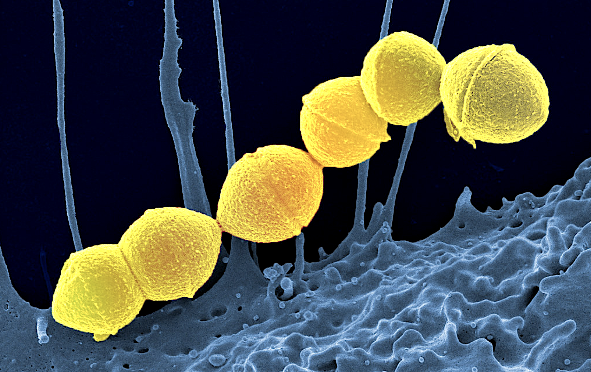

```{r setup, include=FALSE}
knitr::opts_chunk$set(echo = TRUE)
```


```{r echo=FALSE, fig.align='center', out.width='15%'}
# Include images and pictures using .png files in the Images folder..(only if you want to.. =))
knitr::include_graphics(c("Images/Whitespace.png"))
```


Thesis Title: information on the main problem.

Time: 16:53 


```{r echo=FALSE, fig.align='center', out.width='15%'}
# Include images and pictures using .png files in the Images folder..(only if you want to.. =))
knitr::include_graphics(c("Images/Whitespace.png"))
```

```{r echo=FALSE, fig.align='center', out.width='15%'}
# Include images and pictures using .png files in the Images folder..(only if you want to.. =))
knitr::include_graphics(c("Images/Whitespace.png"))
```

Degree Programme: Master of Engineering in Bioinformatics and Systems Biology

Date of Submission: Friday 27th June 2025  

Thesis: 30 ECTS 

Signature: 

```{r echo=FALSE, fig.align='right', out.width='17%'}
# Include images and pictures..

knitr::include_graphics(c('Images/logo.png'))
```

\newpage

# APPROVAL OF THESIS 

Author Name: Miss Oriade Latifah Simpson 

Student Identification number: s172084 

```{r echo=FALSE, fig.align='center', out.width='5%'}
# Include images and pictures using .png files in the Images folder..(only if you want to.. =))
knitr::include_graphics(c("Images/Whitespace.png"))
```

Title of Thesis Research Proposal: 

Thesis Approval Date: Friday 27th June 2025 

**Responsible Supervisor(s)**: Professor Edwin En Te Hwu


```{r echo=FALSE, fig.align='center', out.width='10%'}
# Include images and pictures using .png files in the Images folder..(only if you want to.. =))
knitr::include_graphics(c("Images/Whitespace.png"))
```

```{r echo=FALSE, fig.align='left', out.width='80%'}
# Include images and pictures..

knitr::include_graphics(c('Images/math.png'))
```
**Technical University of Denmark**

**DTU Health Tech**

**Department of Health Technology**

**Building 210**

**Kongens Lyngby 2800 DK**

**Denmark**

\newpage

# STATEMENT OF THESIS ORIGINALITY 

## Declaration of Authorship

I, Miss Oriade Latifah Simpson, hereby declare that the present master's thesis is my own original work and has been written independently. This thesis has not been submitted, either in whole or in part, for the award of any academic degree or qualification at any other institution.

All sources of information and ideas that are not my own have been appropriately acknowledged and referenced. I affirm that this work complies with the ethical and academic standards required for submission at the Technical University of Denmark.

This thesis is submitted in partial fulfilment of the requirements for the Master’s Programme at the Department of Health Technology, Technical University of Denmark.


\newpage

# Abstract

This section provides a concise summary of the research, including the central research question, the methodology employed,  key findings and the main conclusions drawn from the analysis. The abstract does not exceed 500 words. It consists of 3 paragraphs each of which contains research problems and objectives research method and research results. The abstract is typed italicised. 

The keywords related to the thesis are listed. ( Write this at the end. ) 


\newpage

# Acknowledgements

First and foremost, I would like to express my deepest gratitude to my mother, Veronika Quintyne, for her unwavering support and encouragement throughout my academic journey. Her belief in me has been a constant source of strength.

Then, I would like to express my deepest gratitude to my father, Vivian Simpson, for his support and encouragement throughout my academic journey.

I am sincerely grateful to Professor Edwin En-Te Hwu, who generously agreed to be my thesis supervisor. His willingness to guide me during this critical phase of my studies meant more than words can express.

My heartfelt thanks also go to Maria Bergström at the Student Advice and Guidance Organisation, whose insightful advice helped me to ask the right questions, both of myself and of others, at key moments during this process.

I am deeply thankful to my Uncle Tyrell and Julie for their financial support during a difficult period when student funding (SU) was delayed. Their generosity helped me to stay focused on my studies.

I would also like to thank Professor Ole Winther for his thoughtful guidance and generosity in offering valuable insights during the development of my thesis, even in a limited capacity.

I would like to acknowledge *The Danish Education System* at the *Technical University of Denmark*. The experience has equipped me with valuable tools for both academic and personal growth, and the challenges presented throughout the programme helped me step outside of my comfort zone in meaningful ways.

I am immensely thankful for the opportunity to write this thesis and to have learned Danish language skills that enable me to connect with a broader community.

I would also like to express gratitude to Frederik Clausen for hiring me as an Aqua Fitness instructor at Lyngby Swimming Pool, and to Dawn Rafferty for her guidance and mentorship during my Aqua Fitness qualification. Engaging in high intensity exercise and fitness alongside my thesis writing significantly contributed to my overall holistic well-being and deepened my understanding of nutrition, anatomy and physiology.

\newpage

# List of Tables 
```{=latex}
\listoftables
```
# List of Figures
```{=latex}
\listoffigures
```


\newpage

```{=latex}
\newpage
\setcounter{tocdepth}{4}
\tableofcontents
```

A detailed outline of all major sections and subsections, accompanied by page numbers for ease of navigation throughout the thesis.

\newpage

# Chapter I 

# INTRODUCTION 


### 1.1 Background of the Problem 


The rationale facts and observations that are important. 
The research problem and why the research problem is important and needs to be researched. 
Apply new knowledge from the program and present a piece of work that involves thinking.  The subject should relate to the program and specific specialisation. 

Set the scene and motivate the problem being studied. It describes a domain and indicates a problem in general terms.

What is the general area being addressed?
What is the motivation for studying a particular problem?

What makes it worth the effort?

Is it a real problem in everyday life?

Is it a theoretical problem that is worth solving?

Would anyone care if I solved this?


### 1.2 Formulation of the problem

The situation or phenomenon that needs to be solved and requires an answer through thorough research and in depth thinking using scientific tools. 

The research has a sense of clarity and authenticity and it is in line with the research objectives it is an important matter and worthy of research and it provides implications for empirical studies. It is supported by primary or secondary data. Based on the research problem research questions can be formulated. 

### 1.3 Objective and Benefits of the Research 

The research objectives reveals the results to be achieve through the research process. The research objective answers the research problem and reflects the scope of the research, the methods used and the expected results. 


### 1.4 Systematics of Writing 

A brief description of the things in each chapter. 

This thesis is submitted in fulfilment of the requirements for a master’s degree in bioinformatics  and serves as a demonstration of advanced research competences. It aims to exhibit the ability to define a clear research question, conduct a comprehensive review of the literature and apply appropriate research methodologies. 

The objective of this study is to critically evaluate existing academic work in the field and to contribute new insights or perspectives that may advance scholarly understanding or have practical relevance.

The thesis presents an opportunity to dive deeply into a specific topic and enhance my expertise and understanding of that area. This process has also provided an opportunity for the development of academic communication skills, both written and oral, as a part of preparing, presenting and defending the thesis findings. 

Through the formulation of a coherent research narrative and the integration of evidence based conclusions, this thesis seeks to generate original contributions with the chosen area of inquiry. 

The master’s thesis contributes original knowledge or insights to a specific discipline which can be beneficial for academic and practical applications. 


# Chapter II 

# LITERATURE REVIEW 

Reviews existing research related to the topic, highlighting gaps that your study aims to address. 

The literature review contains the theoretical basis and discussion of the results of previous similar studies. A framework of thought and hypothesis can also be put forward. 

# 2.1 Theoretical Foundations and Previous Research 

The theories supporting the hypothesis are said. The research problem has not been answered or solved satisfactorily. 

What is the research context and discipline the thesis fiits within? 

Who has looked at this area before?

What is the state of the art of methods and solution to the problem?

What other work complements this research ?


## 2.2 Framework 

The problems to be studied are explained. There is a research hypothesis. This explanation is included in the form of a schematic to clarify the purpose of the study. This is a series of thought arrangements about what should happen so the intended hypothesis arises. 

## 2.4 Hypotheses | Problem Statement | Research Question 

The hypothesis is a short statement that is concluded from the literature review and it is a temporary answer to the problem under study. The hypothesis is supported by theories or references from previous studies. 

This is a statement of the hypothesis and problems. 

The hypothesis is the highest level problem or goal you are going to to address. 

The problems should be unambiguous. 

The importance of the problem should be mentioned if it was not already done so. 

You can develop a new approach for solving a well known problem or replicate a method in the literature. 

Data Collection Method of Analysis

\newpage

# The Skin 

## The Function of the Skin

The skin is the largest organ of the human body and is comprised of a diverse array of specialised cells types. It serves as a critical barrier that protects the internal organs from bacteria invasion, environmental pathogens, ultraviolet (UV) radiation and various biochemical agents.In addition to its protective role, the skin plays a fundamental part in thermoregulation by modulating body temperature and enabling adaptation to fluctuating environmental conditions.[@noauthor_integumentary_nodate]

  
Furthermore, the skin facilitates the excretion of sweat, sebum, and metabolic waste products through its glandular structures [@noauthor_integumentary_nodate]. It possesses wound-healing capabilities, allowing for the repair of abrasions, lacerations and other forms of tissue injury [@noauthor_integumentary_nodate]. The subcutaneous fat layer functions as a mechanical cushion, providing shock absorption and an additional line of defence against infection [@noauthor_integumentary_nodate].

The skin also contributes to endocrine function through its role in the synthesis of vitamin D upon exposure to UV radiation [@noauthor_integumentary_nodate]. Additionally, it plays a vital sensory role, continuously transmitting information to the central nervous system regarding the external environment [@healthline2018layers]. The skin is integrated with the nervous system to enable the perception of thermal stimuli, tactile sensations, and other sensory inputs essential for survival and interaction with the environment [@healthline2018layers;@noauthor_integumentary_nodate]. 

\newpage

## The Structure of the Skin

The skin is composed of three primary layers: the **epidermis**, the **dermis**, and the **hypodermis** (also known as the subcutaneous fat layer). Each layer performs specific functions essential to maintaining homeostasis, immunity and overall health.

### The Epidermis

The **epidermis** is the outermost layer of the skin and is primarily composed of keratinocytes, which are specialised cells responsible for the synthesis of keratin, cytokines, growth factors and interleukins. This layer provides the first line of defence against environmental pathogegns and is organised into four distinct strata, arranged from superficial to deep. 

 - *The Stratum corneum*
 - *The Stratum granulosum*
 - *The Stratum spinosum*
 - *The Stratum basale* (also referred to as the *stratum germinativum*
 or the basal cell layer).

An illustrative representation of the epidermis is provided below [@smith2016epidermis].

```{r echo=FALSE, fig.align='center', out.width='90%', fig.cap="Structure of the epidermis with the different strata, resting on the dermis (Source: Shuttershock.com, Jose Luis Calvo, News Medical 2025)"}

knitr::include_graphics("Images/Epidermis.png")
```

The **stratum corneum** consists of *terminally differentiated* keratinocytes. Terminally differentiated cells exit the cell cycle as they can no longer divide.
The keratinocytes become corneocytes in the stratum corneum. 
*Corneocytes* are non-viable, enucleated cells [@caon2020examination].

The corneocytes function to minimise transepidermal water loss and provide protection against mechanical and microbial damage. Keratin produced in the underlying layers accumulates in the corneocytes, which are eventually shed through a natural process known as desquamation. 

The skin surface is interspersed with pores, which serve as conduits for the excretion of sweat and sebum via eccrine and sebaceous glands, respectively [@healthline2018layers]. 

The **stratum spinosum**, or *prickle cell layer*, lies above the stratum basale and consists of keratinocytes connected by desmosomes, which provide structural support. In this layer, keratinocytes begin producing cytokeratins that form tonofibrils. Langerhans cells, involved in immune defence, are also present in this layer. 

The **stratum granulosum** contains flattened keratinocytes that undergo terminal differentiation. Keratinocytes accumulate keratohyalin granules,involved in keratin aggregation, and lamellar bodies, which secrete lipids that form a barrier to water loss. Keratinocytes in this layer begin to lose their nuclei and organelles as they prepare for transformation into dead corneocytes of the uppermost layer ;the stratum corneum.

The **stratum basale** (or stratum germinativum) is the deepest layer of the epidermis and plays a central role in skin regeneration. This layer has mitotically active keratinocytes, which divide to replenish the upper layers. In addition to keratinocytes, several other specialised cells are found within this layer :

- **Melanocytes**, which produce melanin, the pigment responsible for skin colour and protection against ultraviolet (UV) radiation [@caon2020examination]. 

- **Langerhans Cells**, (LCs) a type of dendritic cell (DC) that originate from hematopoietic stem cells in the bone marrow. They have a role in immune surveillance by recognising antigens and initiating T-cell responses [@caon2020examination].

- **Merkel cells**, which are mechanoreceptors involved in the sensation of touch. 

- **Dendritic cells**, which also play a defence role in the immune response as they differentiate into macrophages [@caon2020examination]. 

Within the **stratum basale** UV radiation stimulates the conversion of provitamin $D_{3}$ into pre-vitamin $D_{3}$ that initiates the cutaneous synthesis of vitamin D. Subsequent hydroxylation in the liver and kidneys leads to the production of the active form of vitamin D [@caon2020examination]. 

The epidermis is not only a structural barrier but also a site of pathological relevance. Several dermatological and systemic conditions occur in this layer including **seborrhoeic dermatitis** (dandruff), **psoriasis**, **atopic dermatitis** (eczema), melanoma, **acne vulgaris **, **actinic keratosis** and pressure ulcers (decubitus ulcers) [@healthline2018layers].

\newpage

### The Dermis

The dermis is the middle layer of the skin, situated beneath the epidermis, and serves as the primary site of structural and functional support. It contains many essential components including blood vessels such as capillaries [@caon2020examination], lymphatic vessels, sweat glands , sebaceous glands, hair follicles, nerve endings, and specialised sensory receptors. The dermis is primarily composed of **collagen** and **elastin**, two fibrous proteins that confer tensile strength and elasticity, respectively. 

The dermis is subdivided into two distinct layers:

 - **The papillary dermis**, the superficial layer, which is composed of loose connective tissue and contains capillaries and sensory neurons. 
 
 - **The reticular dermis**, the deeper layer, composed of dense irregular connective tissue rich in collagen and elastin fibres, glands, hair follicles, and larger blood vessels. 
 
The dermis contains sweat glands, sebaceous glands, blood vessels, lymphatic vessels, and other structures critical to skin function. These glands play essential roles in thermoregulation, lubrication, and excretion. The eccrine glands are responsible for sweat production, while the sebaceous glands secrete sebum to maintain skin hydration and barrier function. Both are embedded within the dermal layer and are regulated by hormonal and neural signals.

The dermis contains sweat glands, sebaceous glands, blood vessels, lymphatic vessels, and other structures critical to skin function. These glands play essential roles in thermoregulation, lubrication, and excretion. The eccrine glands are responsible for sweat production, while the sebaceous glands secrete sebum to maintain skin hydration and barrier function. Both are embedded within the dermal layer and are regulated by hormonal and neural signals.


Fibroblasts, the predominant cell type in the dermis, are responsible for synthesising collagen proteins, and other components of the extracellular matrix,  which maintains the structural framework of connective tissues. 
In addition to their structural role, fibroblasts are actively involved in **wound healing** through production of signalling molecules and matrix proteins [@genome2025fibroblast].

Collagen is the most abundant protein in the human body and is found not only in the skin but also in muscles, bones, tendons, ligaments, blood vessels, internal organs and the gastrointestinal lining [@clevelandclinic2025collagen]. The primary amino acids in collagen include glycine, proline and hydroxyproline, which assemble into a characteristic triple-helix structure to form collagen fibrils. The biosynthesis of this structure requires several cofactors, including **vitamin C**, **zinc**, **copper** and **manganese** [@clevelandclinic2025collagen].


Among the specialised mechanoreceptors in the dermis are Meissner's corpuscles and Pacinian corpuscles, which detect mechanical stimuli such as touch, pressure, and vibration. These corpuscles are multicellular structures (of multiple cell types) consisting of a sensory nerve ending surrounded by specialised Schwann cells.

 The vascular network within the dermis plays a crucial role in thermoregulation by adjusting blood flow in response to temperature changes [@caon2020examination]. The nerve endings transmit sensory information such as touch, pain, and temperature [@caon2020examination].
Dermal Immune cells contribute to the inflammatory response following injury or infection. 

The dermis contains a diverse population of cells, including fibroblasts, immune dendritic cells, macrophages, T lymphocytes, mast cells, innate lymphoid cells, neutrophils, eosinophils, and natural killer cells, neuronal cells and endothelial cells [@moon2021invitro]. 

Among the immune cells, T lymphocytes are predominantly located in close proximity to blood vessels, vessels, hair follicles and sweat glands within the dermis. Subsets of T cells perform distinct immunological functions: **Th1 cells ** secrete cytokines that enhance the capacity of other immune cells to target and eliminate pathogens l however, dysregulation of Th1 activity may contribute to the development of autoimmune disorders [@moon2021invitro]. **Th2 cells** are primarily involved in the mediation of allergic responses. **Th17 cells** play a crucial role in defending against bacterial and fungal infections and are implicated in the pathogenesis of inflammatory skin diseases such as eczema and psoriasis.

In contrast, **regulatory T cells (Tregs)** modulate immune responses by suppressing excessive inflammation through the release of inhibitory signals and by eliminating over-active immune cells, thereby maintaining immune homeostasis with the dermis [@moon2021invitro] .
 
Several conditions originate within the dermis, including wrinkles (due to collagen degradation), cellulitis (a bacterial skin infection), dermoid cysts (which may contain hair or teeth), sebaceous cysts, and dermatofibromas.

An illustrative representation of the dermis containing sweat glands, sebaceous glands, blood vessels, lymphatic vessels is shown below[@sweatglands_mayo].

```{r echo=FALSE, fig.align='right', out.width='80%', fig.cap="Eccrine \\& sebaceous glands in the dermis (Source: Mayo Foundation, 2025)"}
knitr::include_graphics("Images/Glands.png")
```

### The Hypodermis

The **hypodermis**, also known as the subcutaneous layer of fat, lies beneath the dermis and primarily consists of adipose tissue. This layer is composed of lipocytes that function to insulate the body, maintain thermoregulation, and serve as an energy reserve. The hypodermis also plays a crucial role in absorbing mechanical shock and protecting underlying muscles and organs. 

Structurally, the hypodermis includes the following key components:

 - Fibroblasts: Cells responsible for the production of collagen [@verywell2025hypodermis]. They also regulate the immune response to producing cytokines and chemokines [@moon2021invitro].
 
 - Adipose tissue: Specialised are fatty tissues composed of lipocytes [@verywell2025hypodermis]

 - Connective tissue: A network of collagen and elastin fibres that support and anchors, and gives structure to other tissues[@verywell2025hypodermis].

 - Blood vessels: Including arteries, veins and capillaries that supply the skin with oxygen rich blood and nutrients, while facilitating thermoregulation [@verywell2025hypodermis].

 - Lymphatic vessels: Structures involved in maintaining fluid homeostasis and transporting lymph, a fluid containing immune cells and waste products[@verywell2025hypodermis].

 - Hair follicles: Structures that anchor individual hair shafts and are associated with sebaceous glands and nerve endings.

 - Nerve fibres: Sensory neurons the body's sense of position and movement in space. 

The hypodermis functions as a supportive and protective layer and has important vascular, immune and sensory roles. 

***

# Streptococcus pyogenes

Streptococcus pyogenes is a Gram-positive, anaerobic bacteria [2] . This is part of the skin microbiota.
Streptococcus pyogenes is known as Group A Streptococcus and because of this is it is subsequently abbreviated as GAS 3,4. 

Streptococcus pyogenes looks like small round cells arranged in chain like structures  [4]. 

It is a bacteria of the Streptococcus genus [4]. 

The Domain is bacteria [4].  
The kingdom is Bacillati 
The phylum is Bacillota [4].  
The Class is Bacilli[4]. 
The order is Lactobacillales [4]. 
The Family is Streptococcaceae [4]. 
The genus is Streptococcus [4]. 
The species is S. Pyogenes [4]. 

This species is beta hemolytic ( complete destruction of red blood cells)  2.  ( what does that mean?) 

### Infection of human Skin 

Streptococcus pyogenes is found on human skin[2].  Streptococcus pyogenes causes a range of clinical diseases as they are important pathogens that infect humans. Therefore it is important that they are treated after diagnosis. 

These infections involve pneumonia , localised skin infection  the skin infection called  impetigo 4,  can cause pharyngitis, autoimmune disorder called rheumatic fever, scarlet fever, deep layers of skin invasion lead to skin infection necrotising fasciitis , acute  glomerulonephritis and other skin infections 2 . 

They can also cause rheumatic heart disease. 

```{r echo=FALSE, fig.align='center', out.width='80%', fig.cap="Streptococcus pyogenes (Source:, 2025)"}

```

### The Virulence Factors 

A virulence factor is a molecular that is produced by a pathogen that gives it the capabilities to establish infection and cause disease. 

virulence factors are Capsules that are outer layer which protect the pathogen from being engulfed by immune cells.  

Adherence factors help the pathogen to attach to host cells.  This allows them to stick to host cells, tissues or the host environment. Cell surface proteins.  Toxins that damage host cells and tissues. 

Enzymes that degrade the host tissues allowing the pathogen to spread and invade  4. Streptokinase, hyaluronidase and DNase are enzyme that help the bacteria break down down blood clothes enables it to invade the immune system  4. These enzymes are produced by 

Streptococcus pyogenes. Streptokinase activates plasminogen. The most important virulence factor produced by Streptococcus pyogenes is called Streptokinase [4]. 

There is also nutrient acquisition to allow the pathogen to obtain the nutrients it needs to survive and replicate. 

The emm gene family is in all Streptococcus pyogenes strains 3. The emm gene family codes for the M proteins. These M proteins are antigens. The M protein is classified based on its N- terminal sequence. 

What is the structure of the M Protein?

What is the structure of the M Protein?

### The M Proteins
The surface proteins produced by  Streptococcus pyogenes are M-protein 

The M-protein changes surface antigens to make it harder for the host to recognise the pathogen.
Streptococcus pyogenes secretes M-family proteins called Enn and Mrp 3. 

The F Proteins
The surface proteins produced by  Streptococcus pyogenes are :
Fibrinogen-binding protein 
Fibronectin binding protein 

Streptococcal pyrogenic exotoxin
Streprococcus pyogenes also secretes streptococcal pyrogenic exotoxin , which activate T cells to produce an immune response. There are least three unique streptococcal pyrogenic exotoxins   4.  

What is the structure of these? 

There is also streptolysin O is an exotoxin produced by Streptococcus pyogenes and lipoteichoic acid which are targets for vaccine development 4.  

streptolysin is an enzyme the causes the lysis of red blood cells and there are two types. SLO and SLS. 

Hyaluronidase enzyme produced by Streptococcus pyogenes breaks down hyaluronic acid in the connective tissue 4. 

There are antimicrobial genes (lmrP, tetM, tetL and tgfT) in S. pyogenes 1 .  The tetracycline resistance gene is called tetM or tetL 1 . 

# Diagnostic Tests

To obtain a sample a throat swab, skin lesion or blood sample is collected from the patient   4. Then rapid antigen detection tests are done. 

They are treated with antibiotics 4.  The DNA contains 1900 genes that code for several virulence factors4. 

The genomes of different strains were sequenced . The genome size is 1.8–1.9 Mbp),[28] encoding about 1700-1900 proteins (1700 in strain NZ131,[29][30] 1865 in strain MGAS5005[31][32]). 

Complete genome sequences of the type strain of S. pyogenes (NCTC 8198T = CCUG 4207T) are available in DNA Data Bank of Japan, European Nucleotide Archive, and GenBank under the accession numbers LN831034 and CP028841.[33] 

Biofilms are a way for S. pyogenes, as well as other bacterial cells, to communicate with each other. In the biofilm gene expression for multiple purposes (such as defending against the host immune system) is controlled via quorum sensing.[34] One of the biofilm forming pathways in GAS is the Rgg2/3 pathway. It regulates SHP's (short hydrophobic peptides) that are quorum sensing pheromones, a.k.a. autoinducers. The SHP's are translated to an immature form of the pheromone and must undergo processing, first by a metalloprotease enzyme inside the cell and then in the extracellular space, to reach their mature active form. The mode of transportation out of the cell and the extracellular processing factor(s) are still unknown. 

https://www.ncbi.nlm.nih.gov/nuccore/NZ_CP028841.1

https://www.ncbi.nlm.nih.gov/protein/XDR38324.1?report=fasta

XDR38324.1 M-related protein Mrp [Streptococcus pyogenes]
MSKRNPNKHYSLRKLKTGTASVAVALTVLGTGLANTTDVKADLSTQENPRVTKAREEALEEVLRSWDYGS
VRAALAGSYRKNLQLENTIKQKDKELSFLSKVLDEAAKKYRESSDKYKQEIGQLKAAAEAEAQKALDALN
NKNKQISDLTNENAQLKEAIEGYVQTIQNASREIAAKQQELAAAKSQLEAKNAEIEALKQQDASKTEEIA
KLQSEAETLENLLGSAKRELTDLQAKLDTATAEKAKLESQVTTLENLLGSAKRELTDLQAKLDAANAEKE
KLQSQAAALEKQLEATKKELADLQAKLAATNQEKEKLEAEAKALKEQLAKQAEELAKLKADKASGAQKPD
TKPGNKEVPTRPSQTRTNTNKAPMAQTKRQLPSTGEETTNPFFTAAALTVIASAGVLALKRKEEN

***

# MELANOMA 


### Neural Crest Cells 

The most important growth factors that regulate the development of melanocytes from neural crest cells (NCCs) include Endothelins, Stem cell factor (SCF), which is the ligand for the c-Kit receptor, and Wnt proteins and Neuregulin-1 (NRG1) which is a key growth factor. 

NRG1 is also important in:
Nervous system: Promotes development of Schwann cells (which form the myelin sheath), supports neuron growth, and synaptic plasticity.
Heart: Regulates the development of heart muscle and blood vessels.
Repair processes: Involved in healing after injury, especially in nerve and heart tissue.
Neuregulin-1 (NRG1) = A key growth factor. Acts via: ErbB receptors.
Also important for: Nervous system and heart development.

Other key signaling pathways involved in melanocyte development include:
The MAPK (mitogen-activated protein kinase) pathway

MAPK stands for Mitogen-Activated Protein Kinase. It's a signalling pathway , a series of protein interactions inside a cell,  that responds to external signals (like growth factors) and tells the cell what to do.

In melanocyte development, the MAPK pathway helps control cell survival (preventing cell death, Proliferation (making more cells), Differentiation (developing into mature melanocytes.

The MAPK pathway is activated when growth factors like Stem Cell Factor (SCF) bind to receptors such as c-Kit on the surface of melanoblasts. This triggers a chain reaction inside the cell that leads to activation of proteins like ERK, which then move to the nucleus and turn on specific genes needed for melanocyte development and melanin production.

\newpage 


\newpage 


### Corneocyte Morphometry 

Corneocyte morphometry refers to the quantitative and qualitative analysis of dead skin cells called corneocytes. Corneocytes are the enucleated cells found in the outermost layer of the epidermis. These cells pay a critical role in maintaining the integrity of the skin barrier and overall epidermal homeostasis. 

Corneocytes are commonly obtained through tape stripping , a minimally -invasive procedure that is used to sequentially removal layers of the stratum corneum. This technique facilitates the collection of corneocytes in a manner that is suitable for microscopic and biochemical analysis [2].

The morphological characteristics of corneocytes such as the size , shape and surface reflects the status and the functional integrity of the skin barrier. In particular , the Natural Moisturising Factor (NMF ) within the corneocytes is directly associated with the hydration and maintenance of the function of the skin as a barrier. 

A notable microscopic feature is the presence of Circular Nano-Objects (CNOs) , which are subcellular protrusions that are found at a high frequency in individuals with atopic dermatitis. The density of CNOs is quantified as the Dermal Texture Index (DTI), which has been shown to correlate with the severity of the atopic dermatitis [2].

Moreover, corneocyte morphometry has proven valuable in clinical dermatological research, particularly for evaluating therapeutic efficacy.  It enables the monitoring of the therapeutic treatment response to topical agents such as corticosteroids and can aid in distinguishing between irritant and allergic contact dermatitis [2].


### Atomic Force Microscopy 

Atomic Force Microscopy (AFM) has emerged as a valuable tool in dermatological research, particularly in the assessment of the skin as a barrier. This technique allows for high resolution, three-dimensional imaging of biological surfaces at the nanoscale, including the detailed topographical analysis of corneocytes obtained via tape stripping [1] . 

Atopic dermatitis (AD) is associated with loss of function mutations in the filaggrin gene (FLG), contributing to impaired skin barrier integrity, immune dysregulation and reduced levels of  Natural Moisturising Factor [1]. 

Atomic Force Microscopy enables precise visualisation of the corneocyte surface morphology, including the identification of Circular Nano Objects (CNOs) from tape-stripped skin samples.  

The quantification of Circular Nano Objects is expressed the Dermal Texture index (DTI), a parameter that correlates with both the clinical severity of atopic dermatitis and the Natural Moisturising Factor concentration in the stratum corneum [1]. 

By providing nanoscale morphological data, Atomic Force Microscopy serves as a quantitative biomarker tool to monitor disease progression and therapeutic response. Its application contributes to a deeper understanding of skin barrier pathophysiology and enhances the evaluation of interventions aimed at restoring barrier function. 


### Optical Pickup Units in Atomic Force Microscopy 

The core components of many low-cost atomic force microscopy (AFM) systems are derived from  optical pickup units (OPUs) developed for  CD and DVD players. These units are compact, inexpensive and easy to repurpose, making them promising candidates for use as point-of-care diagnostic technologies [5].

The Atomic Force Microscope is a non-invasive and highly sensitive tool used for quantitative assessment of the skin barrier function [5] . It enables nanometer-scale imaging of biological samples, including corneocytes, by detecting minute surface topographies [5]. 

An optical pickup unit from a DVD player is a miniature optical system that employs a laser to scan the surface of a data disc and detect the reflected signal to interpret the stored digital information. The reflected light is captured by a photodetector, which converts the optical signal into a binary digital signal output (0 or 1), corresponding to the stored information [ 5]. In the context of the AFM, the laser and photodetector components of the optical pickup unit are repurposed to detect sub-nanometer defections of a cantilever probe as it interacts with a sample surface.

A tiny cantilever with a sharp tip , typically only a few nanometers wide, that feels the surface of the sample (skin cells). As the tip traverses over the surface of the skin cells, it is subjected to intermolecular forces such as van der Waals interactions and electrostatic forces,  which cause the cantilever to bend or deflect [5].

These deflections  of the cantilever tip are detected by the optical pickup unit’s laser and photodetector system, enabling high resolution surface profiling and nanometer scale imaging of corneocytes and other biological structures [5] . 

The optical pickup unit laser and detector are crucial components that allow the system to detect incredibly small deflections of the cantilever tip. These deflections occur as the tip interacts with the surface of the skin cells and this is how Atomic Force Microscope achieves nanometer - scale imaging and probing [5]. 

The adaptation of optical pickup units from consumer electronic for scientific instrumentation demonstrates an innovative and cost-effective approach to biomedical imaging, particularly for applications requiring accessible and portable solutions [5] . 


### Deflection Detection via Optical Pickup Systems in Atomic Force Microscopy

In atomic force microscopy (AFM) , the optical pickup system plays a central role in detecting cantilever deflections with high precision. A low-power laser beam is directed onto the rear surface of the reflective cantilever, which is typically coated with gold or aluminium to enhance reflectivity and signal accuracy [6].

As the AFM tip interacts with the skin sample surface, the cantilever bends in response to intermolecular forces. These deflections alter the angle of the reflected laser beam which is then projected onto a position-sensitive photodetector, commonly configured as a four-quadrant photodiode [6].

Sub-nanometer deflections of the cantilever result in measurable displacement of the laser spot on the detector. The change in position on the photodiode can be accurately measured. These positional changes are converted into voltage signals, which correspond to the vertical displacement (deflection) of the cantilever tip [6].

A feedback control loop continuously adjusts the vertical position of the cantilever to maintain a constant interaction force between the tip and the sample. These vertical adjustments are recorded and subsequently used to reconstruct a topographical map of the sample surface, achieving a nanometer-scale resolution [6]. 

Beyond imaging,  Atomic Force Microscopy is capable of assessing the mechanical properties of biological samples such as  stiffness and elasticity, without the need for staining or vacuum environments. or vacuum. This capacity makes it particularly suitable for investigating the surface morphology, skin cell structure, cell-membrane architecture and mechano-biological behaviour of skin cells in both health and pathological conditions [6]. By leveraging the optical pickup system, the Atomic Force Microscope acts like an ultra-sensitive eye and enables detailed visualisation and characterisation of the skin barrier structures at the nanoscale. This contributes significantly to scientific understanding of dermatological physiology and disease. 

\newpage

# Chapter III

# RESEARCH METHODS 

3.1 Types and Sources of Data 

3.2 Methods of Collecting Data 

3.3 Methods of Analysis
This section describes the techniques of analysis and the mechanism for using tools in research. 

The job is to translate the problems into research goals and briefly indicate how you will solve the problem and which method you will use to solve it. 

It is important to have clear goals. 

You have to accomplish your goals in the thesis. 


\newpage

# Chapter IV 

# RESULTS AND ANALYSIS 

Presents the findings of the research often with charts and graphs to illustrate data. The GUI created look like this, but I have to get it to scan the image properly, and also take in the real time data correctly. 

## 4.1 Data Analysis 

This is the results of the data processing according to the analytical tools and techniques. 

Where do you get your data?

Where do you analyse it?

Can you do this yourself?

##  4.2 Interpretations 

## 4.3 Implications or Perspectives 4.4 Impact - Innovation and Application 

You should summarise what you expect to be the most important find is or contributions. What to you do about the problem you have identified. 

\newpage

# CHAPTER V 

# CONCLUSION 

## 4.1 Conclusion 

The conclusion is a brief presentation of what has been obtained from the discussion.
Summarises the key findings and their importance offering final thoughts on the research. 

## 4.2 Limitations 
The limitations of the study describe the weaknesses and shortcomings found after analysis and interpretations of the results. 

## 4.3 Suggestion 

Suggestions for future research. 

Describes the research design, methods used for data collection and analysis and justifies the chosen approach. 

Interprets the results, linking them back to the research questions and existing literature, discussing implications, limitations and future research directions. 

\newpage 


Lists all the sources cited in the thesis in a consistent format. 

Anatomy and Physiology 

Riethmüller, Christoph. ‘Assessing the Skin Barrier via Corneocyte Morphometry’. Experimental Dermatology, vol. 27, no. 8, Aug. 2018, pp. 923–30. DOI.org , https://doi.org/10.1111/exd.13741.

131476@au.dk. Guidelines for Writing Your Thesis Report. https://studerende.au.dk/en/studies/subject-portals/agroecology-food-and-environment/bachelors-project-masters-thesis-and-other-projects/masters-thesis/thesis-projects-at-agricultural-and-food-science/guidelines-for-writing-your-thesis-report. Accessed 13 May 2025 

ZoteroBib: Fast, Free Bibliography Generator - MLA, APA, Chicago, Harvard Citations. https://zbib.org/. Accessed 13 May 2025.

Pereda, Jorge, et al. ‘A Review of Atomic-Force Microscopy in Skin Barrier Function Assessment’. Journal of Investigative Dermatology, vol. 144, no. 10, Oct. 2024, pp. 2136–44. DOI.org (Crossref), https://doi.org/10.1016/j.jid.2024.04.005.

Alsteens, David. ‘Microbial Cells Analysis by Atomic Force Microscopy’. Methods in Enzymology, vol. 506, Elsevier, 2012, pp. 3–17. DOI.org, https://doi.org/10.1016/B978-0-12-391856-7.00025-1.

Arduino. (n.d.). Getting started with Arduino. Retrieved May 15, 2025, from https://docs.arduino.cc/learn/starting-guide/getting-started-arduino/ 

8.  ‘Stromlinet Nano - Nanoscience Made Easy’. The World’s First Arduino Compatible Atomic Force Microscope , My Site, https://www.stromlinet-nano.org/products. Accessed 17 May 2025

https://www.unyt.edu.al/page/thesis-manuals

chrome-extension://efaidnbmnnnibpcajpcglclefindmkaj/https://students.uu.nl/sites/default/files/Course%20manual%20IS%20Thesis%202022-2023.pdf

https://grad.gatech.edu/theses-dissertations

https://grad.gatech.edu/theses-dissertations

Arduino Language Reference - Detailed documentation of the Arduino programming language

https://docs.arduino.cc/language-reference/en/functions/analog-io/analogRead/

Analog Input pins https://docs.arduino.cc/learn/microcontrollers/analog-input/

https://docs.arduino.cc/language-reference/

\newpage

# Appendices

Supplementary material, such as raw data, questionnaires or additional charts that are relevant to the thesis but not critical in the main sections. 


# Bibliography 

# References


