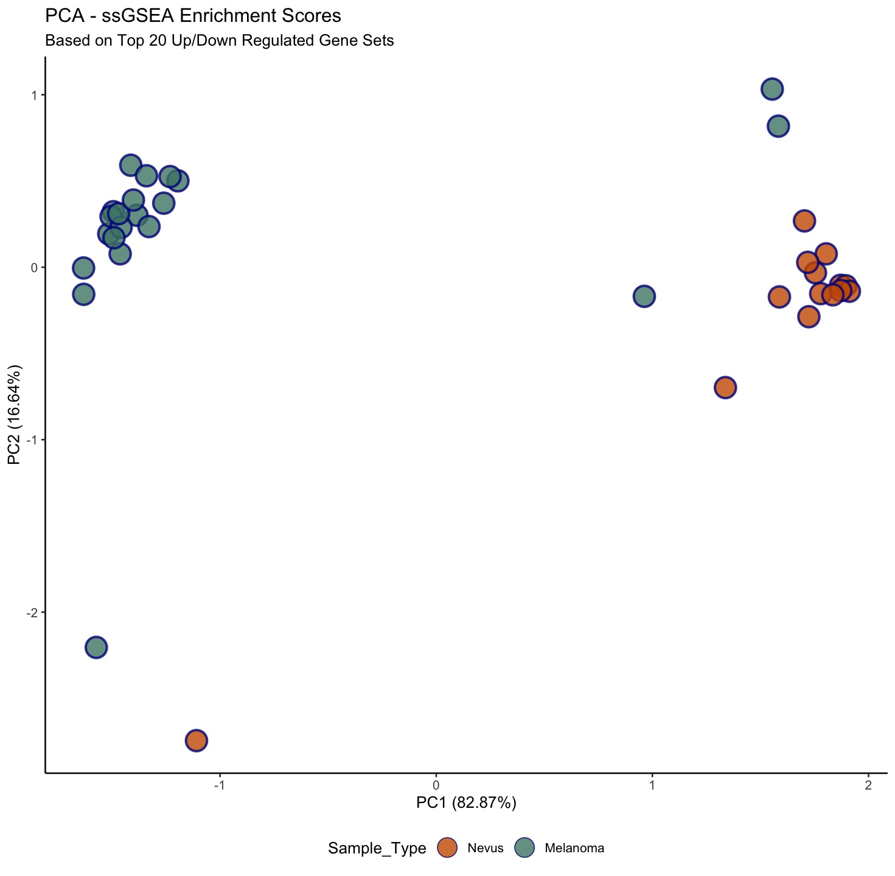
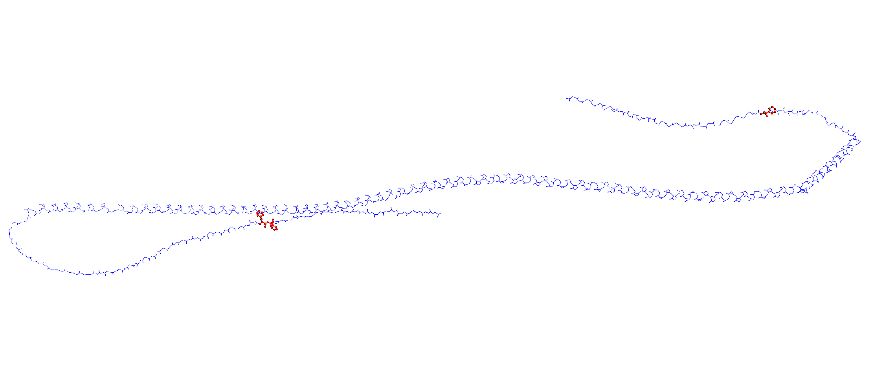
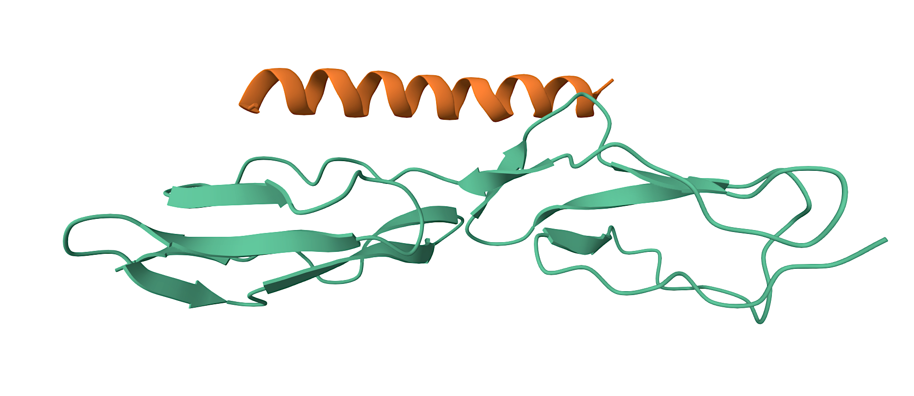

```{r setup, include=FALSE}
knitr::opts_chunk$set(echo = TRUE)
```


```{r echo=FALSE, fig.align='center', out.width='15%'}
# Include images and pictures using .png files in the Images folder..(only if you want to.. =))
knitr::include_graphics(c("Images/Whitespace.png"))
```


```{r echo=FALSE, fig.align='center', out.width='15%'}
# Include images and pictures using .png files in the Images folder..(only if you want to.. =))
knitr::include_graphics(c("Images/Whitespace.png"))
```

```{r echo=FALSE, fig.align='center', out.width='15%'}
# Include images and pictures using .png files in the Images folder..(only if you want to.. =))
knitr::include_graphics(c("Images/Whitespace.png"))
```

Degree Programme: Master of Engineering in Bioinformatics and Systems Biology

Date of Submission: Friday 27th June 2025  

Thesis: 30 ECTS 


```{r echo=FALSE, fig.align='right', out.width='17%'}
# Include images and pictures..

knitr::include_graphics(c('Images/logo.png'))
```

\newpage

# APPROVAL OF THESIS 

Author Name: Miss Oriade Latifah Simpson 

Student Identification number: s172084 

```{r echo=FALSE, fig.align='center', out.width='5%'}
# Include images and pictures using .png files in the Images folder..(only if you want to.. =))
knitr::include_graphics(c("Images/Whitespace.png"))
```

Title of Thesis Research Proposal: Decoding Cutaneous Gene Signatures: A Bioinformatic Investigation into Melanoma, Skin pathophysiology , and the M Protein of Streptococcus pyogenes.

Thesis Approval Date: Friday 27th June 2025 

**Responsible Supervisor(s)**: Professor Edwin En Te Hwu


```{r echo=FALSE, fig.align='center', out.width='10%'}
# Include images and pictures using .png files in the Images folder..(only if you want to.. =))
knitr::include_graphics(c("Images/Whitespace.png"))
```

```{r echo=FALSE, fig.align='left', out.width='80%'}
# Include images and pictures..

knitr::include_graphics(c('Images/math.png'))
```


**Technical University of Denmark**

**DTU Health Tech**

**Department of Health Technology**

**Building 210**

**Kongens Lyngby 2800 DK**

**Denmark**

\newpage

# STATEMENT OF THESIS ORIGINALITY 

## Declaration of Authorship

I, Miss Oriade Latifah Simpson, hereby declare that the present master's thesis is my own original work and has been written independently. This thesis has not been submitted, either in whole or in part, for the award of any academic degree or qualification at any other institution.

All sources of information and ideas that are not my own have been appropriately acknowledged and referenced, including AI tools [@openai2023chatgpt]. I affirm that this work complies with the ethical and academic standards required for submission at the Technical University of Denmark.

This thesis is submitted in partial fulfilment of the requirements for the Master’s Programme at the Department of Health Technology, Technical University of Denmark.


\newpage

# Acknowledgements

First and foremost, I would like to express my deepest gratitude to my mother, Veronika Quintyne, for her unwavering support and encouragement throughout my academic journey. Her belief in me has been a constant source of strength.

Then, I would like to express my deepest gratitude to my father, Vivian Simpson, for his support and encouragement throughout my academic journey.

I am sincerely grateful to Professor Edwin En-Te Hwu, who generously agreed to be my thesis supervisor. His willingness to guide me during this critical phase of my studies meant more than words can express.

My heartfelt thanks also go to Maria Bergström at the Student Advice and Guidance Organisation, whose insightful advice helped me to ask the right questions, both of myself and of others, at key moments during this process.

I am deeply thankful to my Uncle Tyrell and Julie for their financial support during a difficult period when student funding (SU) was delayed. Their generosity helped me to stay focused on my studies.

I would also like to thank Professor Ole Winther for his thoughtful guidance and generosity in offering valuable insights during the development of my thesis, even in a limited capacity.

I would like to acknowledge *The Danish Education System* at the *Technical University of Denmark*. The experience has equipped me with valuable tools for both academic and personal growth, and the challenges presented throughout the programme helped me step outside of my comfort zone in meaningful ways.

I am immensely thankful for the opportunity to write this thesis and to have learned Danish language skills that enable me to connect with a broader community.

I would also like to express gratitude to Frederik Clausen for hiring me as an Aqua Fitness instructor at Lyngby Swimming Pool, and to Dawn Rafferty for her guidance and mentorship during my Aqua Fitness qualification. Engaging in high intensity exercise and fitness alongside my thesis writing significantly contributed to my overall holistic well-being and deepened my understanding of nutrition, anatomy and physiology.

\newpage

```{=latex}
\listoftables
```


```{=latex}
\listoffigures
```

\newpage

```{=latex}
\newpage
\setcounter{tocdepth}{3}
\tableofcontents
```

\newpage

# Abstract

*This thesis investigates the structural and functional aspects of the skin with a focus on two distinct but interrelated biological systems:*

   - *1. Cutaneous Malignant Melanoma and Nevi samples*
   
   - *2. Streptococcus pyogenes, a pathogenic bacterium known for skin invasiveness*

*The primary aim is to explore how bioinformatics approaches can be leveraged to better understand skin pathology from both oncological and microbiological perspectives.*

*For the melanoma analysis, high-throughput gene expression data were used to identify differentially expressed genes between melanoma and benign Nevi samples. Advanced computational methods including Linear Models for Microarray Data (LIMMA), Gene Set Variation Analysis(GSVA), and the ESTIMATE algorithm were applied to evaluate tumour purity and immune cell infiltration. Functional enrichment analyses and pathway mapping using KEGG were employed to understand the roles of key genes in tumour progression.*

*In parallel, genomic data from multiple clinical strains of Streptococcus pyogenes were retrieved from NCBI databases to look at the diversity of specific virulence genes. Phylogenetic analyses and emm-typing were conducted to explore evolutionary patterns. Structural Bioinformatics approaches were applied to investigate the protein structure encoded by virulence genes.The overarching goal is to contribute to genomic biomarker discovery, vaccine target identification and to the broader integration of bioinformatics in dermatology and infectious disease research.*

\newpage

# Chapter I: INTRODUCTION 

## Background & Motivation

The human skin is the largest organ of the body and it serves as the first line of defence against external environmental pathogens. It is a common site for a range of diseases, from bacterial infections to malignant cancers. 

In dermatological research significant attention has been directed towards understanding the onset of Melanoma. It is also important to investigate how bacterial pathogens such as Streptococcus pyogenes breach the skin barrier. 

Melanoma remains to be one of the most aggressive forms of skin cancer. The prognosis is poor if there is a late stage diagnosis. The identification of molecular biomarkers to guide early detection of Melanoma may provide a way to deliver personalised therapies. Precision oncology, through bioinformatics may offer tools to uncover the underlying genomic architecture of melanoma and assess tumour heterogeneity patterns. 

Streptococcus pyogenes is a well-documented pathogen that causes a spectrum of skin infections. The virulence of this bacterium is attributed to various factors including the M protein, encoded by the emm gene, which aids in immune evasion and bacterial colonisation of human host tissues. Understanding the genomic diversity and the protein structure of these virulence factors may inform vaccine development and therapeutic interventions. 

This thesis aims to explore the structure and function of the skin in health and disease using bioinformatic methods, contributing new insights into two distinct domains: cancer genomics and microbial pathogenesis. 


## Research Problem and Objectives

The research is grounded in the application of bioinformatics methodologies to address the following central problems: 

 - **Melanoma Analysis**: To identify differentially expressed genes between melanoma and benign nevi, investgate tumour purity levels and map these findings onto biological pathways to elucidate cancer mechanisms. 
 
 - **Streptococcus pyogenes Analysis** : To evaluate the genetic diversity of S. pyogenes virulence factors, particularly the *emm* gene family, and perform structural bioinformatics analysis on proteins such as the M protein to predict their interaction with the host skin cells. 
 
These problems are addressed through computational analyses of publicly available genomic datasets and the development of reproducible code, documented in R and hosted in a Github repository. The research incorporates data retrieval from the NCBI, gene expression analysis using LIMMA, pathways and enrichment analysis and phylogenetic tree construction. 
 

## Research Questions and Hypotheses

### Research Questions

 - 1. Which key genes are differentially expressed between melanoma and nevi, and how do they contribute to tumour development and immune response?

 - 2. What is the genetic diversity of virulence factors, particularly the emm genes, across different S. pyogenes strains, and how does this correlate with infection severity?

 - 3. Can structural bioinformatics reveal conserved residues in virulence proteins that serve as potential therapeutic targets?

### Hypotheses

### Melanoma Hypotheses:

 - Certain genes are significantly upregulated or downregulated in melanoma compared to nevi, and these genes are enriched in immune system-related GO terms and pathways.

 - Tumour samples exhibit variable immune infiltration and stromal content, which can be quantified using the ESTIMATE algorithm.

 - Network analysis will reveal key genes and protein interactions involved in melanoma pathogenesis.
 

### S. pyogenes Hypotheses:

 - *S. pyogenes* strains share a conserved set of core virulence genes, with strain-specific variants contributing to clinical outcomes.

  - Phylogenetic clustering of strains aligns with emm types and their associated virulence profiles.

 - The M protein contains conserved structural motifs essential for binding to human skin receptors.

 - Structural variants in virulence proteins correlate with host immune evasion strategies and tissue tropism.


## Research Significance

The integration of genomics, bioinformatics, and structural biology in this research holds practical relevance for both oncology and infectious diseases. By identifying biomarkers and understanding the molecular interactions of pathogens and tumors with skin tissue, this research may:

 - Support the development of targeted therapies and vaccines.

 - Advance precision medicine approaches tailored to individual genetic profiles.

 - Enhance interdisciplinary collaboration between computational biology and clinical research.

## Overview of the Method

The research employs a multi-faceted computational pipeline:

**Melanoma Analysis**: Differential gene expression (LIMMA), GSVA/ssGSEA, KEGG pathway analysis, ESTIMATE scoring.

**S. pyogenes Analysis**: Genomic sequence download from NCBI, emm typing, phylogenetic tree construction, protein structure prediction.

All code is written in R and stored in a public GitHub repository alongside the data and visualisations. The thesis document is written in RMarkdown and compiled to PDF, with reference management facilitated by Zotero.

## Structure of the Thesis
This thesis is submitted in fulfilment of the requirements for a master’s degree in bioinformatics and serves as a demonstration of advanced research competences. It aims to exhibit the ability to define a clear research question, conduct a comprehensive review of the literature and apply appropriate research methodologies. 

The objective of this study is to critically evaluate existing academic work and to contribute new insights or perspectives that may advance scholarly understanding or have practical relevance.

The thesis presents my only opportunity to dive deeply into specific topics related to the structure and function of the skin, Cutaneous Malignant Melanoma and **Streptococcus pyogenes** bacteria. 

The research is part of a bigger github portfolio which contains all code and images and this thesis which has been written during the Spring Season of 2025. 

The references are made using Zotero [@zoterobib2025] and are listed in the references.bib file which was used to make the references below in the rmarkdown document. The thesis is written in RMarkdown and knitted to pdf. 

\newpage

# Chapter II: LITERATURE REVIEW 

# The Skin 

## The Function of the Skin

The skin is the largest organ of the human body and is comprised of a diverse array of specialised cells types. It serves as a critical barrier that protects the internal organs from bacteria invasion, environmental pathogens, ultraviolet (UV) radiation and various biochemical agents.In addition to its protective role, the skin plays a fundamental part in thermoregulation by modulating body temperature and enabling adaptation to fluctuating environmental conditions.[@noauthor_integumentary_nodate]

Furthermore, the skin facilitates the excretion of sweat, sebum, and metabolic waste products through its glandular structures [@noauthor_integumentary_nodate]. It possesses wound-healing capabilities, allowing for the repair of abrasions, lacerations and other forms of tissue injury [@noauthor_integumentary_nodate]. The subcutaneous fat layer functions as a mechanical cushion, providing shock absorption and an additional line of defence against infection [@noauthor_integumentary_nodate].

The skin also contributes to endocrine function through its role in the synthesis of vitamin D upon exposure to UV radiation [@noauthor_integumentary_nodate]. Additionally, it plays a vital sensory role, continuously transmitting information to the central nervous system regarding the external environment [@healthline2018layers]. The skin is integrated with the nervous system to enable the perception of thermal stimuli, tactile sensations, and other sensory inputs essential for survival and interaction with the environment [@healthline2018layers, @noauthor_integumentary_nodate]. 

```{r echo=FALSE, fig.align='center', out.width='70%', fig.cap="AI Image of the Skin (Source: Microsoft Designer , Stunning Designs in a Flash, Image Generator, https://designer.microsoft.com/ 2025)"}


```
Image created by Microsoft Designer[@microsoft_designer]. 

\newpage


## The Structure of the Skin

The skin is composed of three primary layers: the **epidermis**, the **dermis**, and the **hypodermis** (also known as the subcutaneous fat layer). Each layer performs specific functions essential to maintaining homeostasis, immunity and overall health.

### The Epidermis

The **epidermis** is the outermost layer of the skin and is primarily composed of keratinocytes, which are specialised cells responsible for the synthesis of keratin, cytokines, growth factors and interleukins. This layer provides the first line of defence against environmental pathogegns and is organised into four distinct strata, arranged from superficial to deep. 

 - *The Stratum corneum*
 - *The Stratum granulosum*
 - *The Stratum spinosum*
 - *The Stratum basale* (also referred to as the *stratum germinativum*
 or the basal cell layer).

An illustrative representation of the epidermis is provided below [@smith2016epidermis].

```{r echo=FALSE, fig.align='center', out.width='90%', fig.cap="Structure of the epidermis with the different strata, resting on the dermis (Source: Shuttershock.com, Jose Luis Calvo, News Medical 2025)"}


```

The **stratum corneum** consists of *terminally differentiated* keratinocytes. Terminally differentiated cells exit the cell cycle as they can no longer divide.
The keratinocytes become corneocytes in the stratum corneum. 
*Corneocytes* are non-viable, enucleated cells [@caon2020examination].

The corneocytes function to minimise transepidermal water loss and provide protection against mechanical and microbial damage. Keratin produced in the underlying layers accumulates in the corneocytes, which are eventually shed through a natural process known as desquamation. 

The skin surface is interspersed with pores, which serve as conduits for the excretion of sweat and sebum via eccrine and sebaceous glands, respectively [@healthline2018layers]. 

The **stratum spinosum**, or *prickle cell layer*, lies above the stratum basale and consists of keratinocytes connected by desmosomes, which provide structural support. In this layer, keratinocytes begin producing cytokeratins that form tonofibrils. Langerhans cells, involved in immune defence, are also present in this layer. 

The **stratum granulosum** contains flattened keratinocytes that undergo terminal differentiation. Keratinocytes accumulate keratohyalin granules,involved in keratin aggregation, and lamellar bodies, which secrete lipids that form a barrier to water loss. Keratinocytes in this layer begin to lose their nuclei and organelles as they prepare for transformation into dead corneocytes of the uppermost layer ;the stratum corneum.

The **stratum basale** (or stratum germinativum) is the deepest layer of the epidermis and plays a central role in skin regeneration. This layer has mitotically active keratinocytes, which divide to replenish the upper layers. In addition to keratinocytes, several other specialised cells are found within this layer :

- **Melanocytes**, which produce melanin, the pigment responsible for skin colour and protection against ultraviolet (UV) radiation [@caon2020examination, @koike2018toll]. 

- **Langerhans Cells**, (LCs) a type of dendritic cell (DC) that originate from hematopoietic stem cells in the bone marrow. They have a role in immune surveillance by recognising antigens and initiating T-cell responses [@caon2020examination].

- **Merkel cells**, which are mechanoreceptors involved in the sensation of touch. 

- **Dendritic cells**, which also play a defence role in the immune response as they differentiate into macrophages [@caon2020examination]. 

Within the **stratum basale** UV radiation stimulates the conversion of provitamin $D_{3}$ into pre-vitamin $D_{3}$ that initiates the cutaneous synthesis of vitamin D. Subsequent hydroxylation in the liver and kidneys leads to the production of the active form of vitamin D [@caon2020examination]. 

The epidermis is not only a structural barrier but also a site of pathological relevance. Several dermatological and systemic conditions occur in this layer including **seborrhoeic dermatitis** (dandruff), **psoriasis**, **atopic dermatitis** (eczema), melanoma, **acne vulgaris **, **actinic keratosis** and pressure ulcers (decubitus ulcers) [@healthline2018layers].

\newpage

### The Dermis

The dermis is the middle layer of the skin, situated beneath the epidermis, and serves as the primary site of structural and functional support. It contains many essential components including blood vessels such as capillaries [@caon2020examination], lymphatic vessels, sweat glands , sebaceous glands, hair follicles, nerve endings, and specialised sensory receptors. The dermis is primarily composed of **collagen** and **elastin**, two fibrous proteins that confer tensile strength and elasticity, respectively. 

The dermis is subdivided into two distinct layers:

 - **The papillary dermis**, the superficial layer, which is composed of loose connective tissue and contains capillaries and sensory neurons. 
 
 - **The reticular dermis**, the deeper layer, composed of dense irregular connective tissue rich in collagen and elastin fibres, glands, hair follicles, and larger blood vessels. 
 
The dermis contains sweat glands, sebaceous glands, blood vessels, lymphatic vessels, and other structures critical to skin function. These glands play essential roles in thermoregulation, lubrication, and excretion. The eccrine glands are responsible for sweat production, while the sebaceous glands secrete sebum to maintain skin hydration and barrier function. Both are embedded within the dermal layer and are regulated by hormonal and neural signals.

The dermis contains sweat glands, sebaceous glands, blood vessels, lymphatic vessels, and other structures critical to skin function. These glands play essential roles in thermoregulation, lubrication, and excretion. The eccrine glands are responsible for sweat production, while the sebaceous glands secrete sebum to maintain skin hydration and barrier function. Both are embedded within the dermal layer and are regulated by hormonal and neural signals.


Fibroblasts, the predominant cell type in the dermis, are responsible for synthesising collagen proteins, and other components of the extracellular matrix,  which maintains the structural framework of connective tissues. 
In addition to their structural role, fibroblasts are actively involved in **wound healing** through production of signalling molecules and matrix proteins [@genome2025fibroblast].

Collagen is the most abundant protein in the human body and is found not only in the skin but also in muscles, bones, tendons, ligaments, blood vessels, internal organs and the gastrointestinal lining [@clevelandclinic2025collagen]. The primary amino acids in collagen include glycine, proline and hydroxyproline, which assemble into a characteristic triple-helix structure to form collagen fibrils. The biosynthesis of this structure requires several cofactors, including **vitamin C**, **zinc**, **copper** and **manganese** [@clevelandclinic2025collagen].


Among the specialised mechanoreceptors in the dermis are Meissner's corpuscles and Pacinian corpuscles, which detect mechanical stimuli such as touch, pressure, and vibration. These corpuscles are multicellular structures (of multiple cell types) consisting of a sensory nerve ending surrounded by specialised Schwann cells.

 The vascular network within the dermis plays a crucial role in thermoregulation by adjusting blood flow in response to temperature changes [@caon2020examination]. The nerve endings transmit sensory information such as touch, pain, and temperature [@caon2020examination].
Dermal Immune cells contribute to the inflammatory response following injury or infection. 

The dermis contains a diverse population of cells, including fibroblasts, immune dendritic cells, macrophages, T lymphocytes, mast cells, innate lymphoid cells, neutrophils, eosinophils, and natural killer cells, neuronal cells and endothelial cells [@moon2021invitro]. 

Among the immune cells, T lymphocytes are predominantly located in close proximity to blood vessels, vessels, hair follicles and sweat glands within the dermis. Subsets of T cells perform distinct immunological functions: **Th1 cells ** secrete cytokines that enhance the capacity of other immune cells to target and eliminate pathogens l however, dysregulation of Th1 activity may contribute to the development of autoimmune disorders [@moon2021invitro]. **Th2 cells** are primarily involved in the mediation of allergic responses. **Th17 cells** play a crucial role in defending against bacterial and fungal infections and are implicated in the pathogenesis of inflammatory skin diseases such as eczema and psoriasis.

In contrast, **regulatory T cells (Tregs)** modulate immune responses by suppressing excessive inflammation through the release of inhibitory signals and by eliminating over-active immune cells, thereby maintaining immune homeostasis with the dermis [@moon2021invitro] .
 
Several conditions originate within the dermis, including wrinkles (due to collagen degradation), cellulitis (a bacterial skin infection), dermoid cysts (which may contain hair or teeth), sebaceous cysts, and dermatofibromas.

An illustrative representation of the dermis containing sweat glands, sebaceous glands, blood vessels, lymphatic vessels is shown below[@sweatglands_mayo].

```{r echo=FALSE, fig.align='right', out.width='80%', fig.cap="Eccrine \\& sebaceous glands in the dermis (Source: Mayo Foundation, 2025)"}
knitr::include_graphics("Images/Glands.png")
```

### The Hypodermis

The **hypodermis**, also known as the subcutaneous layer of fat, lies beneath the dermis and primarily consists of adipose tissue. This layer is composed of lipocytes that function to insulate the body, maintain thermoregulation, and serve as an energy reserve. The hypodermis also plays a crucial role in absorbing mechanical shock and protecting underlying muscles and organs. 

Structurally, the hypodermis includes the following key components:

 - Fibroblasts: Cells responsible for the production of collagen [@verywell2025hypodermis]. They also regulate the immune response to producing cytokines and chemokines[@moon2021invitro].
 
 - Adipose tissue: Specialised are fatty tissues composed of lipocytes [@verywell2025hypodermis]

 - Connective tissue: A network of collagen and elastin fibres that support and anchors, and gives structure to other tissues[@verywell2025hypodermis].

 - Blood vessels: Including arteries, veins and capillaries that supply the skin with oxygen rich blood and nutrients, while facilitating thermoregulation [@verywell2025hypodermis].

 - Lymphatic vessels: Structures involved in maintaining fluid homeostasis and transporting lymph, a fluid containing immune cells and waste products[@verywell2025hypodermis].

 - Hair follicles: Structures that anchor individual hair shafts and are associated with sebaceous glands and nerve endings.

 - Nerve fibres: Sensory neurons the body's sense of position and movement in space. 

The hypodermis functions as a supportive and protective layer and has important vascular, immune and sensory roles. 

***

\newpage
# Streptococcus pyogenes

## Streptococcus pyogenes:Taxonomy, Morphology & Clinical Relevance

*Streptococcus pyogenes* is a Gram-positive, anaerobic bacterium commonly referred to as Group A Streptococcus(GAS) [@proctor2023_fibrinogen,@abusaiba2023_review]. 

The Gram-positive nature is due to a thick peptidoglycan layer in its cell wall, which retains the crystal violet stain.

Structurally, *S.pyogenes* is characterised by its beta-hemolytic activity, meaning it causes complete lysis of red blood cells on blood agar plates.
Morphologically, the cells are small, spherical, and typically arranged in chains, a feature that distinguishes them from other bacterial species[@abusaiba2023_review].

Taxonomically, *S.pyogenes* is classified as follows:

 - **Domain**: *Bacteria*
 
 - **Kingdom**: *Bacillati*
 
 - **Phylum**: *Bacillota*
 
 - **Class**: *Bacilli*
 
 - **Order**: *Lactobacillales*
 
 - **Family**: *Streptococcaceae*
 
 - **Genus**: *Streptococcus *
 
 - **Species**: *S.pyogenes* [@abusaiba2023_review]
 
As a highly adaptable pathogen, *S.pyogenes* is capable of causing a wide range of clinical diseases, from mild superficial infections to severe invasive conditions. Its chain-like cellular arrangement and distinct beta-hemolytic properties are key identifiers in both clinical and microbiological contexts. 

## Infection of Human Skin

*Streptococcus pyogenes* is a significant pathogen responsible for a wide spectrum of clinical diseases. Prompt diagnosis and treatment of *S.pyogenes* infections are critical due to the organism's capacity to cause both superficial and systemic illnesses. 

Skin infections caused by *S.pyogenes* range from localised conditions such as impetigo to more severe and invasive diseases, including necrotising fasciitis, a life-threatening infection of the deep dermal and subcutaneous tissues [@nci_streptococcus_pyogenes,@abusaiba2023_review].

In addition to skin infections, *S.pyogenes* is known to cause pharyngitis, pneumonia, scarlet fever, acute post-streptococcal glomerulonephritis, and the autoimmune condition rheumatic fever. In chronic cases,*S.pyogenes* may also contribute to the development of rheumatic heart disease. 

```{r echo=FALSE, fig.align='center', out.width='90%', fig.cap="Streptococcus pyogenes (Source:National Institute of Allergy and Infectious Diseases (NIAID), Flickr, December 29, 2022)"}

```

## Virulence Factors of Streptococcus pyogenes
Virulence factors are molecules produced by pathogens that facilitate infection, survival and damage within the host. *S.pyogenes* expresses a diverse array of virulence factors that enable its pathogenicity, immune system invasion, and tissue invasion [@abusaiba2023_review]. 

**1. Capsules**
The bacterium produces a capsule that protects it from being engulfed by the host immune cells.  

**2. Adherence Factors**
Adherence factors (Adhesins), including lipoteichoic acid (LTA) and fibronectin-binding proteins help the bacterium to attach to host epithelial cells and tissues. 

**3. Surface Proteins**
Surface proteins such as M protein and related members (e.g. Mrp and Enn) play crucial roles in immune evasion. These proteins have variable antigens which allow the pathogen to avoid recognition by the host immune system. 

**4. Enzymes**
*S.pyogenes* secretes several enzymes that degrade host tissues and promote bacterial invasion. These include: 

 - **Streptokinase:** Converts plasminogen to plasmin, aiding in the breakdown of fibrin blood clots.
 
 - **Hyaluronidase:** Degrades hyaluronic acid in connective tissue, facilitating bacterial spread.
 
 - **DNases:** Break down extracellular DNA.
 

**5. Toxins**
*S.pyogenes* produces streptolysins (SLO and SLS), exotoxins that lyse red blood cells and other host cells. Additionally, streptococcal pyrogenic exotoxins (SPEs) are super-antigens that activate T cells and induce a massive immune response. At least three distinct SPEs have been identified [@abusaiba2023_review].

### The M Protein 

The M protein is a major virulence factor encoded by the emm gene family, which is present in all *S.pyogenes* strains [@proctor2023_fibrinogen]. These surface-anchored proteins are involved in adherence, immune evasion, and resistance to phagocytosis. 

The M protein is considered one of the most important virulence factors. 

- **Structure:** The M protein is a coiled-coil molecule anchored in the bacterial membrane, with a highly variable N-terminal region responsible for antigenic diversity. 

- **Function:** It interferes with opsonisation and complement activation, making it a key player in immune system evasion. The M-protein changes surface antigens to make it harder for the host to recognise the pathogen.

- **Variants:** M-related proteins such as Mrp and Enn, along with fibronectin-binding proteins, are also expressed and contribute to pathogenicity. 

### F proteins
F proteins are another group of surface adhesins produced by *S.pyogenes*. These include fibrinogen-binding and fibronectin-binding proteins, which facilitate tight adherence to host tissues and are critical in the early stages of infection. 

### Streptolysins and Exotoxins 
- Streptolysin O (SLO) and Streptolysin S (SLS) are cytolytic toxins that cause hemolysis and contribute to tissue damage during infection. 

- Streptococcal pyrogenic exotoxins (SPEs) are potent super-antigens activate T cells and stimulate a massive immune response, often leading to severe systemic symptoms.

### Lipoteichoic Acid and Vaccine Targets

Lipoteichoic acid is a key surface molecule involved in adherence and immune activation, and it is under investigation as a potential target for vaccine development [@abusaiba2023_review]. 

## Antimicrobial Resistance 

*S.pyogenes* also harbours genes associated with antimicrobial resistance. Notable among these are:

 - **lmrP:** Encodes a multidrug efflux pump
 - **tetM and tetL:** Confer resistance to tetracyclines. 
 - **tgfT:** involved in resistance to specific antimicrobial agents [@boutin2024_genomic].
 
These resistance genes highlight the need for continuous surveillance and prudent use of antibiotics in treating *S.pyogenes* infections.

## Biofilm Formation and Quorum Sensing in Streptococcus pyogenes

Biofilms are structured microbial communities encased within a self-produced extracellular matrix. In *Streptococcus pyogenes*, biofilm formation facilitates communication between cells and contributes to bacterial surviva, particularly under host immune response and exposure to antibiotics. This communication is mediated by a mechanism known as quorum sensing, which regulates gene expression in response to cell density. 

In *S.pyogenes*, one of the key quorum sensing pathways involved in biofilm development is the Rgg2/3 pathway.This pathway controls the expression of genes involved in biofilm formation through the modulation of short hydrophobic peptides, which act as quorum sensing pheromones, also referred to as autoinducers.

Short hydrophobic peptides are initially synthesised in an immature form within the bacterial cell. To become functionally active, these peptides undergo a two-step processing mechanism. First, an intracellular metalloprotease enzyme processes the SHPS. Subsequently, they undergo further processing in the extracellular environment to reach their mature, biologically active form.

The specific transport mechanism responsible for the SHP export and the identity of the extracellular processing factor(s) remain to be elucidated.

The Rgg2/3 pathway is essential for biofilm maturation and plays a central role in *S.pyogenes* pathogenesis, particularly in facilitating persistent infections by enhancing resistance to host immune defences and antimicrobial agents. 

\newpage

# Melanoma

## Introduction to Melanoma

Melanoma is a highly prevalent form of skin cancer originating from the melanocytes [@sinha2025nrp1, @tao2024melanoma, @li2025integrating, @liu2022gene].

As mentioned in the earlier section, Melanocytes are cells that contribute to skin colouration due to the creation of melanin[@mayo2025melanoma]. A tumour occurs when the DNA mutates inside of the Melanocyte cells [@mayo2025melanoma, @jayaraj2024bioinformatics]. Melanoma is notable for its high metastatic potential[ @li2025integrating, @xie2025centromere]. 

Melanoma has several distinct subtypes, including Acral Melanoma[@tsetsos2025], Mucosal Melanoma and Uveal Melanoma, each arising in different anatomical sites and with unique molecular profiles[@jayaraj2024bioinformatics]. In contrast to keratinocyte carcinomas which include basal cell carcinoma and squamous cell carcinoma, these melanomas originate from melanocytes[@tsetsos2025]. 

## Related Skin Cancers
Other rare cutaneous malignancies include Sebaceous Carcinoma and Apocrine Adenocarcinoma, as well as Merkel Cell Carcinoma, a neuroendocrine tumour strongly linked with exposure to ultraviolet light. Although these cancers are less common than melanoma, they use similar methods for diagnosis and molecular testing.

```{r echo=FALSE,fig.align='center',out.width='90%', fig.cap="Melanoma , Diseases and Conditons (Source Mayo Clinic, June 2025)"}
knitr::include_graphics("Images/melanoma.png")
```

## Melanocyte Development and Key Pathways 

The development of Melanocytes from neural crest cells (NCCs) is regulated by a network of growth factors and intracellular signalling pathways[@xie2025centromere, @koike2018toll]. 

The most important regulatory molecules are endothelins and stem cell factors.
Stem cell factors are ligands for the c-Kit receptor. Other critical growth factors include members of the Wnt protein family and Neuregulin-1 (NRG1). 

### Neuregulin-1

Neuregulin-1 (NRG1) is a growth factor that is known for its pleiotropic effects[@sinha2025nrp1]. 
In addition to its role in melanocyte biology, NRG1 is a key growth factor within the nervous system. It promotes development of Schwann cells, glial cells that form the myselin sheath, while also supporting neuron growth and enhancing synaptic plasticity.

Furthermore, Neuregulin-1 contributes to the repair of the cardiac and vascular tissues and acts via ErbB receptors.

### The Mitogen-Activated Protein Kinase (MAPK) signalling pathway

The Mitogen-Activated Protein Kinase (MAPK) signalling pathway is central to the development of melanocytes[@liu2022gene]. This pathways plays a fundamental role in cell survival, proliferation and differentiation. Signalling pathways are cascades of protein interactions that respond to growth factors to direct the cells. 

The MAPK pathway is activated when stem cell factors bind to the c-Kit receptors on the melanoblast cell surface. The binding event initiates a signalling cascade that leads to the activation of extracellular signal-regulated kinases (ERKs).
These kinases move to into the nucleus and activate gene expression processes required for melanocyte development and melanin biosynthesis.  

Understanding how melanocytes normally develop is important for figuring out how melanoma begins and spreads, since problems in these signalling pathways are often involved in the disease process. 

## Diagnosis and Imaging Techniques
Magnetic Resonance Imaging (MRI) is the primary diagnostic tool for Melanoma.
MRI can be conducted with or without the use of contrast agents to enhance lesion visualisation. In cases where imaging results are inconclusive or suspicious, a biopsy is performed to obtain a tissue sample for histological and molecular examination[@tao2024melanoma].

Histopathological analysis typically involves immunohistochemical staining protocols, where tissue samples are incubated in biotin and stained used haematoxylin blue/black nuclear stain and eosin pink cytoplasmic stain to highlight cellular architecture and pathology[@tao2024melanoma]. To preserve biological integrity for subsequent analyses, the specimen are often cryopreserved. 

## Molecular and Genetic Characterisation 
The identification of genetic mutations and molecular pathways involved in melanoma is pivotal for both diagnosis and the development of targeted therapies. Several genes are recognised as therapeutic biomarkers and are investigated for the presence of mutations [@tao2024melanoma]. 

Minimal Residual Disease (MRD) relates to the small number of cancer cells that may remain in the body during or after treatment for Melanoma and potentially lead to recurrence. Minimal Residual Disease is typically assessed via liquid biopsy, a minimally invasive technique that analyses circulating tumour DNA (ctDNA) in cerebrospinal fluid, blood or urine.

This ctDNA analysis is referred to as fragmentomics and it uses advanced techniques such as Digital PCR (dPCR) and Droplet Digital PCR (ddPCR) to detect mutations.

Micro-RNAs (microRNA) also play a significant role in melanoma pathogenesis.
For example, miR-21 is often up-regulated in patients with Melanoma and breast cancer. These non-coding RNAs are regulators of gene expression and may serve as diagnostic and prognostic biomarkers[@tao2024melanoma].

## Omics Approaches in Melanoma Research 
Comprehensive molecular profiling using omics based technologies has changed the classification and understanding of melanoma [@sinha2025nrp1]. 
Transcriptomics, which investigates the full range of RNA transcripts expressed in tumour cells, provides insight into the functional state of cancerous tissues [@sinha2025nrp1]. 
Methylomics, focusing on DNA methylation patterns reveals epigenetic modifications that contribute to the oncogenesis and may serve as early diagnostic indicators. 
Microarray based transcription profiling is employed for high throughput analysis of gene expression, while cell surface proteomic analysis enables the identification of differentially expressed membrane proteins. 

## Molecular Subtyping and Future Directions
Molecular subtyping of melanoma has become a cornerstone of personalised oncology. 
By integrating data from genomics, transcriptomics and proteomics, clinicians and researchers can classify tumours into subtypes that inform prognosis and therapeutic response. This systems biology approach not only enhances diagnostic precision but also opens up avenues for novel targeted treatments[@xie2022identification]. Bioinformatics studies may provide a clearer understanding of the molecular mechanisms behind melanoma metastasis[@xie2022identification].

Further insights into the overlap between cutaneous and Uveal Melanoma have been gained through bioinformatics approaches which identify shared gene expression signature and signalling pathways[@jayaraj2024bioinformatics]. 
Such comparative analyses deepen the understanding of melanoma heterogeneity and path the way for cross-subtype therapeutic strategies[@xie2022identification]. 


\newpage
# Chapter III : RESEARCH METHODS 

## Overview of Research Design

This thesis investigates two biologically distinct but methodologically complementary topics: 

- The analysis of gene expression and immune-related pathways in melanoma
 
- The genomic and structural analysis of virulence genes in Streptococcus pyogenes.

Despite being different biological systems, both studies rely on bioinformatics and integrative genomic approaches.

```{bash eval=FALSE, include=FALSE}
Describes the research design, methods used for data collection and analysis and justifies the chosen approach. 
Interprets the results, linking them back to the research questions and existing literature, 
discussing implications, limitations and future research directions.
```

# Topic I: Melanoma — Gene Expression and Pathway Analysis

### Topic 1: Melanoma Data and Methods

### Data Sources

 - National Centre for Biotechnology Information (NCBI) Gene Expression Omnibus (GEO) dataset

The data used in this study were obtained from publicly available databases and include the *Cutaneous Malignant Melanoma* dataset. 
Specifically, I utilized gene expression data and associated clinical information from tumour samples available through the National Centre for Biotechnology Information (NCBI) Gene Expression Omnibus (GEO).

 - Clinical information, GPL96 Affymetrix Microarray Data, gene expression
 
```{r echo=FALSE, fig.align='center', out.width='90%', fig.cap="Cutaneous Malignant Melanoma dataset (Source:GDS Browser, 2025)"}

```

### Data Preprocessing

Normalization, filtering, preprocessing tools

### Analytical Methods

 - Linear Models for Microarray and Omics Data (LIMMA) : Differential Gene Expression 
 
 - Principal Component Analysis

 - KEGG/Pathway analysis

 - GSVA / ssGSEA

 - Tumour Analysis using the ESTIMATE package 

***

# Topic II: Streptococcus pyogenes — Virulence Gene & Protein Analysis

### Data Sources

 - Public databases (National Center for Biotechnology Information (NCBI) , AlphaFold)
 
 - Genomic Data Acquisition (FASTA files)
 
 - Download of genomic and protein sequence data of multiple S. pyogenes strains from NCBI.
   
 - Standardized file naming and merging into emm.fasta.
 
 - Include Table of emm genes and strains.
 
The genomic sequence data for this study was obtained from the National Centre for Biotechnology Information (NCBI) GenBank database. The complete coding sequences of several emm genes encoding the M protein from *Streptococcus pyogenes* of various strains were downloaded. These DNA sequences were originally submitted to GenBank by Murayama et al. from the Laboratory of Molecular Cell Biology, School of Pharmacy, Nihon University, Japan and subsequently published in the database. 
 
These sequences represent a linear bacterial DNA fragment. Each fragment contains the complete coding sequence for the M protein, a major virulence factor of *Streptococcus pyogenes* [@genbank_AB548438]. 

### Data Preparation

 - Renaming FASTA files

 - Merging into emm.fasta (unix commands)

### Analytical Methods

 - MUSCLE alignment of emm genes

 - WebLogo Motif Analysis

 - Phylogenetic Tree Construction
  - Use aligned sequences to infer phylogeny and strain relationships.
  - Evaluate whether emm-type clusters correlate with virulence gene presence.

-  Protein Structure Prediction
   - Use Swiss-Model and PyMOL to model M protein structure
   
***


\newpage
# Chapter IV: RESULTS AND ANALYSIS 

# RESULTS - Topic I: Melanoma
## Overview of the Dataset

The dataset selected for this study is the *Cutaneous Malignant Melanoma* dataset, identified by GEO Data Set (GDS) accession number **GDS1375** and series number **GSE3189**, comprised of a total of 70 samples. This dataset was made publicly available on the 25th day of August in 2005. It consists of microarray gene expression profiles from three distinct sample groups: 45 malignant melanoma samples, 18 benign skin nevus samples and 7 normal skin samples. 

For the purposes of this analysis, the SOFT file was downloaded and both the phenotype data and gene expression counts were extracted and processed.From the full dataset, a subset was selected for differential analysis, comprising of 21 malignant melanoma samples and 14 skin nevus samples. The 7 normal skin samples were excluded from this comparative analysis. 

```{r echo=FALSE, fig.align='center', out.width='90%', fig.cap="Selection of GSE3189 Series Data (Source:GDS Browser, 2025)"}

```
\newpage

```{r include=FALSE}
library(GEOquery)
library(limma)
library(Biobase)
library(tidyverse)
library(viridis)
library(pheatmap)
library(ggpubr)
library(edgeR)
library(umap)
library(dplyr)
library(ggplot2)
library(factoextra)
library(estimate)

# Getting GSE Series Matrix files as an ExpressionSet (based on Bioconductor instructions)
# Extract expression matrix
new_gse3189 <- getGEO('gse3189',GSEMatrix=TRUE)
```

```{r include=FALSE}
show(new_gse3189)
#Look at the metadata 

# -------------------- Viewing Expression Data Information ----------------------
# Get the expression matrix
expr_matrix <- exprs(new_gse3189[[1]])
mel_pheno <-pData(new_gse3189[[1]])

# Basic info
cat("Number of genes:", nrow(new_gse3189[[1]]), "\n")
cat("Number of samples:", ncol(new_gse3189[[1]]), "\n")
```


```{r include=FALSE}
# -------------------- Sample Selection ----------------------

# Function to identify sample types from both columns
identify_sample_type <- function(char_ch1, description) {
  # Convert to lowercase for easier matching
  char_lower <- tolower(char_ch1)
  desc_lower <- tolower(description)
  
  # Check for melanoma
  if(grepl("melanoma", char_lower) | grepl("melanoma", desc_lower)) {
    return("Melanoma")
  }
  # Check for nevus
  else if(grepl("nevus|nevi", char_lower) | grepl("nevus|nevi", desc_lower)) {
    return("Nevus")
  }
  # Check for normal
  else if(grepl("normal", char_lower) | grepl("normal", desc_lower)) {
    return("Normal")
  }
  else {
    return("Unknown")
  }
}

# Apply function to identify sample types
mel_pheno$sample_type <- mapply(identify_sample_type, 
                                mel_pheno$characteristics_ch1, 
                                mel_pheno$description)


# -------------------- Extract Specific Numbers of Samples ----------------------
set.seed(123)  # For reproducible sampling

# Extract samples
normal_samples <- mel_pheno[mel_pheno$sample_type == "Normal", ]
nevus_samples <- mel_pheno[mel_pheno$sample_type == "Nevus", ]
melanoma_samples <- mel_pheno[mel_pheno$sample_type == "Melanoma", ]

# Sample the required numbers (if available)
extract_samples <- function(df, n_samples, sample_name) {
  if(nrow(df) >= n_samples) {
    selected <- df[sample(nrow(df), n_samples), ]
    cat(paste("Selected", n_samples, sample_name, "samples\n"))
    return(selected)
  } else {
    cat(paste("Warning: Only", nrow(df), sample_name, "samples available, need", n_samples, "\n"))
    return(df)
  }
}

# Extract required samples
selected_normal <- extract_samples(normal_samples, 7, "Normal")
selected_nevus <- extract_samples(nevus_samples, 14, "Nevus")
selected_melanoma <- extract_samples(melanoma_samples, 21, "Melanoma")

# Combine selected samples for analysis (Melanoma vs Nevus only)
analysis_samples <- rbind(selected_melanoma, selected_nevus)
analysis_samples$sample_type <- factor(analysis_samples$sample_type, levels = c("Nevus", "Melanoma"))

print("Selected samples for analysis:")
print(table(analysis_samples$sample_type))

# -------------------- Prepare Expression Data ----------------------
# Extract expression data for selected samples
sample_ids <- rownames(analysis_samples)
analysis_expr <- expr_matrix[, sample_ids]
analysis_expr

# Check dimensions
cat("Expression matrix dimensions:", dim(analysis_expr), "\n")
cat("Number of samples in analysis:", ncol(analysis_expr), "\n")


# -------------------- Data Preprocessing ----------------------
# Remove genes with low expression (optional but recommended)
# Calculate mean expression for each gene
gene_means <- rowMeans(analysis_expr)

# Filter genes with very low expression (you can adjust this threshold)
expressed_genes <- gene_means > quantile(gene_means, 0.25)  # Keep top 75% expressed genes
analysis_expr_filtered <- analysis_expr[expressed_genes, ]
```

```{r include=FALSE}
cat("Genes after filtering:", nrow(analysis_expr_filtered), "\n")
```

\newpage
## Differential Gene Expression

```{r include=FALSE}
# -------------------- Limma-Voom Analysis ----------------------
# Create design matrix
design <- model.matrix(~ sample_type, data = analysis_samples)
design

colnames(design) <- c("Intercept", "Melanoma_vs_Nevus")

print("Design matrix:")
print(design)

# Convert to DGEList object for voom
dge <- edgeR::DGEList(counts = analysis_expr_filtered)

# Calculate normalization factors
dge <- calcNormFactors(dge)

# Apply limma voom transformation
v <- voom(dge, design, plot = TRUE)
v

# Fit linear model
fit <- lmFit(v, design)

# Apply empirical Bayes
# Empirical bayes pulls very high variance estimates toward the average (shrinks them down) and pulls very low variance estimates toward the average (shrinks them up)
fit <- eBayes(fit)
```

### Mean-variance trend

```{r echo=FALSE}
plotSA(fit, main = "Mean variance trend, GSE3189",
       family = 'Times')
```


This is a diagnostic plot where each point represents a gene. The x-axis shows the average log2-counts per million (logCPM) for each gene. The y-axis shows the estimated variance (or square root of standard deviation) of the log2 expression values for each gene. The trend line is plotted over the points to estimate the mean-variance relationship in the dataset. The mean-variance trend shows a relatively stable variance across expression levels, indicating the normalization and statistical modelling are appropriate for differential expression analysis. 

```{r include=FALSE}
# -------------------- Results ----------------------
# Get differential expression results
results <- topTable(fit, 
                    coef = "Melanoma_vs_Nevus", number = Inf, sort.by = "P")


cat("Differential Expression Results Summary:\n")
cat("Total genes analyzed:", nrow(results), "\n")
    
cat("Significantly upregulated genes (adj.P.Val < 0.05, logFC > 1):", 
    sum(results$adj.P.Val < 0.05 & results$logFC > 1), "\n")

cat("Significantly downregulated genes (adj.P.Val < 0.05, logFC < -1):", 
    sum(results$adj.P.Val < 0.05 & results$logFC < -1), "\n")

# View top results
print("Top 20 differentially expressed genes:")
print(results[1:20, c("logFC", "AveExpr", "t", "P.Value", "adj.P.Val")])


# Add gene symbols from the ExpressionSet
# Using the $ operator with backticks
results$gene_symbol <- fData(new_gse3189[[1]])[rownames(results), ]$`Gene Symbol`

# View results with gene symbols
head(results, 20)

# Summary with gene symbols
cat("Top 20 differentially expressed genes:\n")
print(results[1:20, c("gene_symbol", "logFC", "AveExpr", "t", "P.Value", "adj.P.Val")])

# ----------------------Looking at the extremes ----------------------------

# Add gene symbols first
results$gene_symbol <- fData(new_gse3189[[1]])[rownames(results), ]$`Gene Symbol`

# Get top 20 UPREGULATED genes (highest positive logFC)
top_upregulated <- results %>%
  filter(logFC > 0) %>%  # Only positive fold changes
  arrange(desc(logFC)) %>%  # Sort by highest logFC first
  head(20)

top_upregulated

# Get top 20 DOWNREGULATED genes (most negative logFC)
top_downregulated <- results %>%
  filter(logFC < 0) %>%  # Only negative fold changes
  arrange(logFC) %>%  # Sort by most negative logFC first
  head(20)

# Display results
cat("TOP 20 UPREGULATED GENES (highest fold change):\n")
print(top_upregulated[, c("gene_symbol", "logFC", "AveExpr", "P.Value", "adj.P.Val")])

cat("\nTOP 20 DOWNREGULATED GENES (lowest fold change):\n")
print(top_downregulated[, c("gene_symbol", "logFC", "AveExpr", "P.Value", "adj.P.Val")])

# Get significantly upregulated/downregulated genes
#cat("\nTOP 20 SIGNIFICANTLY UPREGULATED GENES (adj.P.Val < 0.05):\n")
sig_upregulated <- results %>%
  filter(adj.P.Val < 0.05 & logFC > 0) %>%
  arrange(desc(logFC)) %>%
  head(20)

kableExtra::kable(sig_upregulated[, c("gene_symbol", "logFC", "AveExpr", "P.Value", "adj.P.Val")])

#cat("\nTOP 20 SIGNIFICANTLY DOWNREGULATED GENES (adj.P.Val < 0.05):\n")
sig_downregulated <- results %>%
  filter(adj.P.Val < 0.05 & logFC < 0) %>%
  arrange(logFC) %>%
  head(20)

kableExtra::kable(sig_downregulated[, c("gene_symbol", "logFC", "AveExpr", "P.Value", "adj.P.Val")])
```

\newpage

 Table: (Table of Top 20 Significantly Up-regulated Genes)

| Gene Symbol                  | Log FC | Ave Expr | P-Value     | Adj P-Value |
|------------------------------|--------|----------|-------------|-------------|
| NTRK3                        | 5.574  | 5.693    | 0.0000129   | 0.0001071   |
| WFDC1                        | 5.222  | 4.888    | 0.0000264   | 0.0001952   |
| HEY1                         | 5.047  | 4.436    | 0.0000000   | 0.0000000   |
| GDF15                        | 4.964  | 5.666    | 0.0000000   | 0.0000000   |
| NTRK3                        | 4.946  | 5.498    | 0.0001644   | 0.0009026   |
| PHACTR1                      | 4.654  | 4.232    | 0.0000001   | 0.0000024   |
| NTRK3                        | 4.639  | 5.913    | 0.0000029   | 0.0000314   |
| SPP1                         | 4.363  | 5.332    | 0.0000000   | 0.0000004   |
| ABHD2                        | 4.228  | 4.999    | 0.0000002   | 0.0000035   |
| NTRK3                        | 3.960  | 6.619    | 0.0000000   | 0.0000011   |
| KIF23                        | 3.849  | 2.064    | 0.0001005   | 0.0005954   |
| MIR6872 /// SEMA3B           | 3.819  | 3.665    | 0.0000005   | 0.0000077   |
| RNFT2                        | 3.800  | 1.402    | 0.0000763   | 0.0004709   |
| NTRK3                        | 3.792  | 6.718    | 0.0000001   | 0.0000016   |
| RASGRF1                      | 3.698  | 1.962    | 0.0044561   | 0.0144427   |
| NTRK3                        | 3.668  | 6.624    | 0.0000001   | 0.0000014   |
| UBE2S                        | 3.557  | 5.534    | 0.0000000   | 0.0000003   |
| ATP6V0E2                     | 3.540  | 6.915    | 0.0000000   | 0.0000000   |
| BCL2A1                       | 3.531  | 4.655    | 0.0000000   | 0.0000000   |
| ARHGAP8 /// PRR5-ARHGAP8     | 3.522  | 2.658    | 0.0147619   | 0.0385832   |


 Table: (Table of Top 20 Significantly Down-regulated Genes)

| Gene Symbol             | Log FC | Ave Expr | P-Value   | Adj P-Value |
|-------------------------|--------|----------|-----------|-------------|
| KRT15                   | -8.013 | 3.912    | 0.0000000 | 0.0000000   |
| KRT14                   | -7.298 | 6.514    | 0.0000000 | 0.0000000   |
| LOR                     | -6.931 | 5.048    | 0.0000000 | 0.0000000   |
| LGALS7 /// LGALS7B      | -6.740 | 5.159    | 0.0000000 | 0.0000000   |
| KRT1                    | -6.686 | 6.289    | 0.0000000 | 0.0000000   |
| SERPINB5                | -6.510 | 3.593    | 0.0000000 | 0.0000000   |
| PKP1                    | -6.493 | 3.489    | 0.0000002 | 0.0000028   |
| KRT5                    | -6.399 | 6.329    | 0.0000000 | 0.0000000   |
| LY6D                    | -6.246 | 3.688    | 0.0000000 | 0.0000000   |
| S100A7                  | -6.224 | 4.062    | 0.0000008 | 0.0000109   |
| FGFR3                   | -6.213 | 3.892    | 0.0000002 | 0.0000035   |
| HOPX                    | -6.075 | 4.480    | 0.0000000 | 0.0000000   |
| AQP3                    | -5.998 | 5.094    | 0.0000000 | 0.0000000   |
| SFN                     | -5.965 | 3.973    | 0.0000000 | 0.0000010   |
| TACSTD2                 | -5.873 | 5.161    | 0.0000000 | 0.0000000   |
| PPL                     | -5.805 | 3.711    | 0.0000000 | 0.0000000   |
| SPRR1A                  | -5.713 | 2.635    | 0.0031335 | 0.0107551   |
| CHL1                    | -5.709 | 3.169    | 0.0000000 | 0.0000000   |
| DSP                     | -5.691 | 5.536    | 0.0000000 | 0.0000000   |
| FLG                     | -5.622 | 4.183    | 0.0000002 | 0.0000032   |

\newpage
### Volcano Plot 

```{r echo=FALSE, fig.align='center', out.width='80%', fig.cap="Volcano Plot I "}

```

```{r echo=FALSE, fig.align='center', out.width='80%', fig.cap="Volcano Plot II"}
knitr::include_graphics(c("Images/Volcano_Labelled.jpeg"))
```

\newpage

### MA Plot
```{r echo=FALSE, fig.align='center', out.width='80%', fig.cap="MA Plot"}

```

\newpage
## Principal Component Analysis (PCA) & Clustering

### Sample Correlation Heatmap

```{r echo=FALSE, fig.align='center', out.width='100%', fig.cap="Sample Correlation Heatmap"}

```
This heatmap shows the pairwise correlations between the samples in the dataset.Yellow signifies a strong correlation and blue signifies no correlation. 
The rows and columns represent the same set of samples. Samples are hierarchically clustered based on their correlation. 
Similar samples are grouped together. However, there is 1 melanoma sample that is clustering with the nevi skin samples.

### Principal Component Analysis (PCA) 
```{r echo=FALSE, fig.align='center', out.width='60%', fig.cap="Principal Component Analysis (PCA)"}

```

Principal Component Analysis (PCA) is a dimensionality reduction technique used to simplify complex datasets by transforming correlated variables into a smaller set of uncorrelated variables called principal components.

```{r echo=FALSE, fig.align='center', out.width='50%', fig.cap="Scree Plot"}
knitr::include_graphics("Images/Scree.png.jpeg")
```
\newpage
### Uniform Manifold Approximation and Projection (UMAP)
```{r echo=FALSE, fig.align='center', out.width='80%', fig.cap="Uniform Manifold Approximation and Projection"}

```

\newpage
## Pathway Analysis
KEGG / GO enrichment KEGG pathways identified to look at genes in melanoma samples
Biological Process and Pathway Analysis

The clusterProfiler package was used for pathway analysis. 

### Top GO Biological Processes
```{r echo=FALSE, fig.align='center', out.width='80%', fig.cap="Gene Ontology Biological Processes"}

```

\newpage

### Top KEGG Pathways 
```{r echo=FALSE, fig.align='center', out.width='80%', fig.cap="KEGG Pathways"}

```

\newpage

## Gene Signature Enrichment

 - GSVA / ssGSEA results
 
 - GSVA to perform ssGSEA analysis on signature genes with GSVA Package. 
 
 Table: (ssGSEA Enrichment Summary)

| Gene Set                 | Mean Difference (Mel-Nevus) | P-value        | Adjusted P-value | Significance                              |
|--------------------------|-----------------------------|----------------|------------------|-------------------------------------------|
| Melanoma Upreg Top20     | 0.524                       | 1.51e-14       | 4.53e-14         | Higher enrichment in Melanoma             |
| Melanoma Downreg Top20   | -0.7301                     | 1.12e-10       | 1.68e-10         | Lower enrichment in Melanoma              |
| All Top DE Genes         | -0.0661                     | 1.08e-02       | 1.08e-02         | Lower enrichment in Melanoma (small diff) | 


```{r echo=FALSE, fig.align='center', out.width='80%', fig.cap="ssGSEA Enrichment Scoress"}

```

```{r echo=FALSE, fig.align='center', out.width='90%', fig.cap="PCA from GSVA"}

```

\newpage

## Tumor Purity Estimation for Melanoma vs Nevus Samples

Table: (ESTIMATE Score Comparison: Melanoma vs Nevus)

| Score         | Melanoma_Mean | Nevus_Mean | P_Value |
|---------------|---------------|------------|---------|
| StromalScore  | -602.188      | -486.441   | 0.6347  |
| ImmuneScore   | -302.864      | -505.272   | 0.5063  |
| ESTIMATEScore | -905.052      | -991.713   | 0.8710  |
| TumorPurity   | 0.869         | 0.879      | 0.8334  |

```{r echo=FALSE, fig.align='center', out.width='90%', fig.cap="ESTIMATE Scores"}

```


\newpage 

# RESULTS – Topic II: Streptococcus pyogenes

### Sequence Dataset Overview

Summary table of GAS strains and emm genes.

Table: (Table of *Streptococcus pyogenes* genomes)

| Name.       |Accession Number | Strain   | Collection Date | Link                                            |  
|-------------|---------------- |----------|-----------------|-------------------------------------------------|
| S. Pyogenes | AE014074.1      | MGAS315  |   31-JAN-2014   |https://www.ncbi.nlm.nih.gov/nuccore/AE014074.1  |
| S. Pyogenes | CP000017.2      | MGAS5005 |   01-APR-2014   |https://www.ncbi.nlm.nih.gov/nuccore/CP000017.2  |
| S. Pyogenes | CP155740.1      | 1851/03  |   06-AUG-2024   |https://www.ncbi.nlm.nih.gov/nuccore/CP155740.1  |

Table: (Table of *Streptococcus pyogenes* emm genes) *Streptococcus pyogenes* emm gene for M protein, complete cds of various strains – Collection Date: 15-JAN-2014

|Accession Number |  Gene Name               |  Strain    | Link                                           |  
|-----------------|--------------------------|------------|------------------------------------------------|
|AB548437.1       | emm1 gene for M protein  |  RE014     |https://www.ncbi.nlm.nih.gov/nuccore/AB548437.1 |
|AB548438.1       | emm28 gene for M protein |  RE015     |https://www.ncbi.nlm.nih.gov/nuccore/AB548438.1 |
|AB548441.1       | emm1 gene for M protein  |  RE020     |https://www.ncbi.nlm.nih.gov/nuccore/AB548441.1 |
|AB548442.1       | emm1 gene for M protein  |  RE025     |https://www.ncbi.nlm.nih.gov/nuccore/AB548442.1 |
|AB548444.1       | emm28 gene for M protein |  RE031     |https://www.ncbi.nlm.nih.gov/nuccore/AB548444.1 |
|AB548445.1       | emm1 gene for M protein  |  RE032     |https://www.ncbi.nlm.nih.gov/nuccore/AB548445.1 |
|AB548446.1       | emm49 gene for M protein |  RE037     |https://www.ncbi.nlm.nih.gov/nuccore/AB548446.1 |
|AB548447.1       | emm49 gene for M protein |  RE039     |https://www.ncbi.nlm.nih.gov/nuccore/AB548447.1 |
|AB548448.1       | emm28 gene for M protein |  RE041     |https://www.ncbi.nlm.nih.gov/nuccore/AB548448.1 | 
|AB548449.1       | emm89 gene for M protein |  RE050     |https://www.ncbi.nlm.nih.gov/nuccore/AB548449.1 |
|AB548450.1       | emm1 gene for M protein  |  RE059     |https://www.ncbi.nlm.nih.gov/nuccore/AB548450.1 |
|AB548451.1       | emm12 gene for M protein |  RE066     |https://www.ncbi.nlm.nih.gov/nuccore/AB548451.1 |
|AB548452.1       | emm49 gene for M protein |  RE076     |https://www.ncbi.nlm.nih.gov/nuccore/AB548452.1 |
|AB548453.1       | emm49 gene for M protein |  RE080     |https://www.ncbi.nlm.nih.gov/nuccore/AB548453.1 |
|AB548454.1       | emm49 gene for M protein |  RE104     |https://www.ncbi.nlm.nih.gov/nuccore/AB548454.1 |
|AB548456.1       | emm49 gene for M protein |  RE121     |https://www.ncbi.nlm.nih.gov/nuccore/AB548456.1 |
|AB548503.1       | emm4 gene for M protein  |  RE342     |https://www.ncbi.nlm.nih.gov/nuccore/AB548503.1 |
|AB548508.1       | emm12 gene for M protein |  RE366     |https://www.ncbi.nlm.nih.gov/nuccore/AB548508.1 |
|AB548516.1       | emm75 gene for M protein |  RE436     |https://www.ncbi.nlm.nih.gov/nuccore/AB548516.1 |
|AB549960.1       | emm58 gene for M protein |  RE614     |https://www.ncbi.nlm.nih.gov/nuccore/AB549960.1 |

Table: (Outgroup:  *Streptococcus pyogenes* emm50 type - emm gene for M protein, partial cds. of various strains – Collection Date: 26-JUN-2013

|Accession Number |  Gene Name           |  Strain    | Link                                           |  
|-----------------|----------------------|------------|------------------------------------------------|
|JX028641.1       | emm gene, emm50 type |   GLS244   | https://www.ncbi.nlm.nih.gov/nuccore/JX028641  |

\newpage

## Phylogenetic Analysis using PAUP 

The FASTA-formatted gene sequences were initially downloaded and subsequently renamed according to a standardised naming convention, incoporating the strain identifier, Genbank accession number, and gene name.
This nomenclature facilitated consistency and traceability throughout the downstream analysis. 

The individual FASTA files were concatenated into a single file using a Bash shell command as shown below:

```{bash eval=FALSE}
cat * > ../emm.fasta
```

The resulting emm.fasta file was then opened in AliView for inspection and manual verification. During this process sequence headers were further edited to ensure uniqueness and clarity. 

To perform multiple sequence alignment , the software **MUSCLE** was employed using the following command:

```{bash eval=FALSE}
muscle -in emm.fasta -out emm_aligned.fasta
```

The aligned sequences (emm_aligned.fasta) were again viewed in AliView to assessalignment quality and make any necessary further adjustments [@larsson_aliview_2014]. 

```{r echo=FALSE, fig.align='center', out.width='100%', fig.cap="AliView"}

```


Following alignment the file was converted into NEXUS format for phylogenetic analysis using a custom Python script `seqconverter.py` [@pedersen_seqconverter_2023] in conjuction with the `sequenclib.py` . 

The phylogenetic analysis was carried out in PAUP* software [@swofford_paup_2003] using the sequence labelled as GLS244 as the designated outgroup. 

```{bash  eval=FALSE}
PAUP
execute emm.nexus
showmatrix
outgroup  GLS244
```

A consensus tree was subsequently generated and visualised using **FigTree** [@rambaut_figtree_2009], allowing for a clear interpretation of the evolutionary relationships among the sampled strains. 

```{bash eval=FALSE}
set root=outgroup outroot=monophyl
contree all /strict=no majrule=yes percent=50
savetrees from=1 to=1 file=consensus_tree.tre format=newick brlens=yes;
figtree consensus_tree.tre
```

```{r echo=FALSE, fig.align='center', out.width='100%', fig.cap=" Consensus Tree"}

```

\newpage

## WebLogo 

To investigate patterns of sequence conservation and variability, a sequence logo was generated using the aligned sequences as input. This visualisation facilitated the identification of conserved motifs and regions of high sequence variability. The sequence logo revealed that the conservations was primarily limited to the N-terminal and C- terminal regions while the central portion of the alignment exhibited variation. 

For clarity and relevance, only representative segments of the logo corresponding to the highly conserved and highly variable regions are presented herein, rather than displaying the full alignment. 

These patterns support the interpretation that conserved regions may be subject to purifying selection and thus potentially involved in essential structural or functional roles. In contrast, variable regions may reflect positive selection pressures, possibly contributing to immune evasion mechanisms in the host-pathogen interaction.

```{r echo=FALSE, fig.align='center', out.width='60%', fig.cap="Sequence Logo 1"}

```

```{r echo=FALSE, fig.align='center', out.width='60%', fig.cap=" Sequence Logo 2"}

```

```{r echo=FALSE, fig.align='center', out.width='60%', fig.cap=" Sequence Logo 3"}

```

\newpage

## AlphaFold three-dimensional protein structure prediction

```{r echo=FALSE, fig.align='center', out.width='100%', fig.cap="AlphaFold"}

```

Based on the amino acid sequence provided in the original FASTA file, the corresponding M protein sequence was retrieved in FASTA format.

```{bash eval=FALSE, include=FALSE}

>lcl|AB548438.1_prot_BAO37395.1_1 [gene=emm28] [protein=M protein]
MARKDTNKQYSLRKLKTGTASVAVAVAVLGAGFANQTEVKAAESPKSTETSANGADKLADAYNTLLTEHE
KLRDEYYTLIDAKEEEPRYKALRGENQDLREKEGKYQDKIKKLEEKEKNLEKKSEDVERHYLKKLDQEHK
EQEERQKNLEELERQSQREIDKRYQEQLQKQQQLETEKQISEASRKSLSRDLEASRAAKKDLEAEHQKLK
EEKQISDASRQGLSRDLEASRAAKKDLEAEHQKLKEEKQISDASRQGLSRDLEASREAKKKVEADLAEAN
SKLQALEKLNKELEEGKKLSEKEKAELQARLEAEAKALKEQLAKQAEELAKLKGNQTPNAKVAPQANRSR
SAMTQQKRTLPSTGEAANPFFTAAAATVMVSAGMLALKRKEEN
```

To predict the three-dimensional structure of the M protein, the amino acid sequence was submitted to AlphaFold, which uses deep learning to infer protein folding patterns.


A BLASTP search was performed against the protein structure database to identify homologous structures. The search returned a 100% identity match with a known M protein sequence in UniProt (accession W0T1Y4).

The predicted structure was examined using PyMOL, a molecular visualisation system. Screenshots of the structural model of the M Protein are provided below [@uniprot_W0T1Y4].

The M protein is encoded by the emm28 gene from Streptococcus pyogenes, has a UniProt ID of W0T1Y4, consists of 393 amino acids in length, and is identified in the Protein Data Bank as AF-W0T1Y4-F1-v4. 

\newpage

```{r echo=FALSE, fig.align='center', out.width='100%', fig.cap="M Protein expressed from emm28 gene - Pymol"}

```

```{r echo=FALSE, fig.align='center', out.width='100%', fig.cap="M Protein expressed from emm28 gene from UniProt"}

```

\newpage

# CHAPTER V : CONCLUSION 

This bioinformatic investigation examined differential gene expression profiles between melanoma and nevus skin samples, using analytical approaches to reveal molecular signatures and pathways associated with Melanoma. The thesis contains various visualisation methods and uses computational tools to identify specific genes and characterise the underlying biological processes governing the transition from benign to malignant skin lesions.

The differential expression analysis revealed distinct molecular signatures distinguishing melanoma from nevus samples. Volcano plot visualisation demonstrated clear separation of significantly up-regulated and down-regulated genes, with log₁₀ p-values plotted against log₂ fold changes revealing robust statistical significance. Among the most prominently unregulated genes in melanoma samples were NTRK3, RASGRF1, SPP1, HEY1, GDF15, and BCL2A1, while genes including KRT15, SERPINB5, LY6D, HOPX, SFN, CHL1, and FLG exhibited significant down-regulation. These findings were corroborated by MA plot analysis, which confirmed the magnitude and significance of expression changes.

Principal Component Analysis revealed intriguing clustering patterns, with one melanoma sample demonstrating molecular similarity to nevus samples, suggesting potential transitional states or heterogeneity within the dataset. This observation was further supported by correlation heatmap analysis, where melanoma sample GSM71709 clustered with nevus samples GSM71680 and GSM71694, indicating shared expression profiles that may represent intermediate stages of transformation. UMAP dimensionality reduction analysis reinforced these findings, showing that nevus sample GSM71680 clustered proximal to multiple melanoma samples, implying potential early transformation characteristics or biological similarity.

Gene Ontology enrichment analysis identified several key biological processes significantly associated with the differentially expressed genes. The analysis revealed enrichment of processes related to epidermis development, regulation of nervous system development, neuron projection development, and epithelial cell proliferation, while keratinocyte differentiation pathways showed reduced enrichment. These findings suggest that melanoma development involves dysregulation of fundamental keratinocyte differentiation.

KEGG pathway analysis elucidated several crucial signalling cascades and biological processes altered in melanoma progression. Significantly enriched pathways included cornified envelope formation, PI3K-Akt signalling, focal adhesion, proteoglycans in cancer, axon guidance, and efferocytosis. Notably, genes associated with human papillomavirus infection were also enriched, which may have clinical relevance given the established relationship between HPV and various skin pathologies.

Gene Set Enrichment Analysis provided additional validation of the differential expression patterns through examination of predefined gene signatures. The analysis of the top 20 up-regulated genes in melanoma demonstrated significant enrichment with a mean difference of 0.524 and adjusted p-value of 4.53×10⁻¹⁴, confirming a distinct melanoma-associated expression profile. 

Tumour microenvironment analysis using the ESTIMATE algorithm provided insights into the cellular composition of the samples. Melanoma samples exhibited lower stromal scores, indicating reduced stromal cell infiltration, while demonstrating higher immune scores suggestive of increased immune cell presence. This pattern may reflect the inflammatory response associated with malignant transformation or immune surveillance mechanisms.

ESTIMATE scores, which integrate both stromal and immune components, were marginally elevated in nevus samples. Tumour purity assessment revealed high values (approximately 0.8) in both sample types.

The phylogenetic analysis revealed strain clustering based on emm gene types, with emm1 and emm12 strains forming distinct evolutionary clades, suggesting conservation of genetic features within specific emm classifications. Sequence alignment and WebLogo analysis of the M protein identified highly conserved regions at both N- and C-termini, which likely play crucial roles in structural stability and functional integrity. The identification of phenylalanine residues at terminal positions is particularly noteworthy, as these aromatic, hydrophobic amino acids are relatively uncommon and may contribute to important structural or binding functions. The hydrophobic nature of phenylalanine suggests potential roles in membrane anchoring, protein-protein interactions, or tertiary structure stabilisation.

The presence of sulphur containing residues in the M protein , likely cysteines, indicates the potential for disulphide bond formation, which is known to confer mechanical stability and is particularly relevant in skin and hair-associated proteins. The conservation of phenylalanine residues across multiple protein homologs implies strong evolutionary pressure for their maintenance, suggesting critical functional roles in protein folding, membrane association, or binding specificity. PyMOL visualisation confirmed the distinct positioning of these residues, potentially highlighting important binding or anchoring sites within the protein structure.

The molecular patterns observed in this study provide valuable insights into the complex biological processes underlying melanoma development and progression. However, several limitations must be acknowledged. The dataset contained only seven normal skin samples, which limited the statistical power for comprehensive comparisons with both nevus and melanoma tissues. Future investigations should incorporate larger, well-annotated cohorts including adequate numbers of normal skin samples to better delineate the molecular changes occurring during early-stage melanoma development.
In conclusion, this comprehensive bioinformatic analysis has successfully identified distinct molecular signatures differentiating melanoma from nevus samples, revealed key pathways, and characterised the tumour microenvironment composition.


\newpage 

# Appendices

### Pymol Script to display M protein structure

```{bash eval=FALSE}
# PyMOL script to display structure

# Hide everything first
hide everything

# Show the carbon backbone as thin wire
show wire, name CA
set stick_radius, 0.1, name CA

# Alternatively, you can show the entire backbone as thin wire:
show wire, backbone
set stick_radius, 0.1, backbone

# Select phenylalanine residues
select phe_residues, resn PHE

# Show phenylalanine residues as ball and stick
show sticks, phe_residues
show spheres, phe_residues

# Color phenylalanine residues orange
color orange, phe_residues

# Turn on valence display for phenylalanine residues
set valence, on, phe_residues

# Optional: Adjust sphere and stick sizes for better visualization
set sphere_scale, 0.3, phe_residues
set stick_radius, 0.15, phe_residues
```
\newpage

Table: (Summary of MUSCLE Alignment Log for emm Genes Isolated from Streptococcus pyogenes)

MUSCLE v3.8.1551 by Robert C. Edgar | http://www.drive5.com/muscle [@edgar_muscle_2004]


| Time     | Memory     | Iteration | Progress  | Step               |
|----------|------------|-----------|-----------|--------------------|
| 00:00:00 | 1 MB(0%)   | 1         | 100.00%   | K-mer dist pass 1  |
| 00:00:00 | 1 MB(0%)   | 1         | 100.00%   | K-mer dist pass 2  |
| 00:00:00 | 22 MB(0%)  | 1         | 100.00%   | Align node         |
| 00:00:00 | 22 MB(0%)  | 1         | 100.00%   | Root alignment     |
| 00:00:00 | 24 MB(0%)  | 2         | 100.00%   | Refine tree        |
| 00:00:00 | 24 MB(0%)  | 2         | 100.00%   | Root alignment     |
| 00:00:00 | 24 MB(0%)  | 2         | 100.00%   | Root alignment     |
| 00:00:01 | 24 MB(0%)  | 3         | 100.00%   | Refine biparts     |
| 00:00:03 | 24 MB(0%)  | 4         | 100.00%   | Refine biparts     |
| 00:00:03 | 24 MB(0%)  | 5         | 100.00%   | Refine biparts     |
| 00:00:03 | 24 MB(0%)  | 5         | 100.00%   | Refine biparts     |


PAUP Tree statistics

Table: ( Tree Statistics from the Consensus Tree)

| Statistic                                | Value   |
|------------------------------------------|---------|
| Tree length                              | 1336    |
| Consistency index (CI)                   | 0.8278  |
| Homoplasy index (HI)                     | 0.1722  |
| CI excluding uninformative characters    | 0.7941  |
| HI excluding uninformative characters    | 0.2059  |
| Retention index (RI)                     | 0.9095  |
| Rescaled consistency index (RC)          | 0.7529  |

\newpage

# References